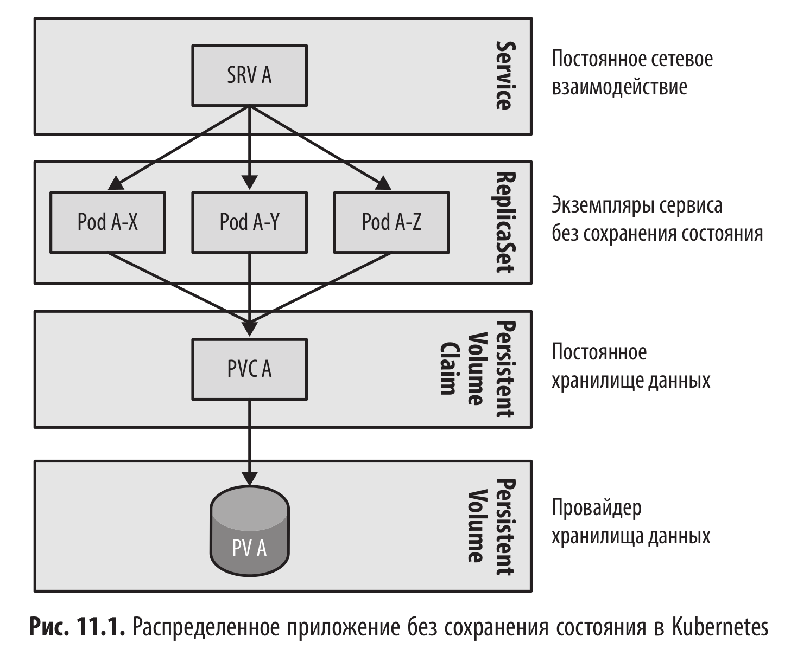

# Сервис без сохранения состояния (Stateless Service)

<br/>



<br/>

### Разбор примеров из книги

<br/>

```shell
$ minikube start --mount --mount-string="$(pwd)/logs:/tmp/example" --memory 2G
```

<br/>

```yaml
$ cat << 'EOF' | kubectl apply -f -
# ReplicaSet as a stateless service
apiVersion: apps/v1
kind: ReplicaSet
metadata:
  name: random-generator
spec:
  # Three stateless copies of the application
  replicas: 3
  selector:
    matchLabels:
      app: random-generator
  template:
    metadata:
      labels:
        app: random-generator
    spec:
      containers:
        - image: k8spatterns/random-generator:1.0
          name: random-generator
          ports:
            - containerPort: 8080
              protocol: TCP
EOF
```

<br/>

```shell
$ kubectl get rs
NAME               DESIRED   CURRENT   READY   AGE
random-generator   3         3         3       22s
```

<br/>

```shell
$ kubectl describe rs random-generator
Name:         random-generator
Namespace:    default
Selector:     app=random-generator
Labels:       <none>
Annotations:  <none>
Replicas:     3 current / 3 desired
Pods Status:  3 Running / 0 Waiting / 0 Succeeded / 0 Failed
***
```

<br/>

### Self-Healing

<br/>

```shell
$ kubectl delete $(kubectl get pods -l app=random-generator -o name | head -1)
```

<br/>

```shell
$ kubectl get pods
NAME                     READY   STATUS    RESTARTS   AGE
random-generator-2bhd6   1/1     Running   0          2m
random-generator-87f5b   1/1     Running   0          2m
random-generator-brjwg   1/1     Running   0          19s
```

<br/>

### Access via a Service

<br/>

```yaml
$ cat << 'EOF' | kubectl apply -f -
apiVersion: v1
kind: Service
metadata:
  name: random-generator
spec:
  selector:
    # Same selector as for the ReplicaSet in order
    # to catch all pods
    app: random-generator
  ports:
    - port: 8080
      protocol: TCP
      targetPort: 8080
  # Type ClusterIP for exposing the service only within the cluster
  type: ClusterIP
EOF
```

<br/>

```shell
$ kubectl run -itq --rm --image=k8spatterns/curl-jq --restart=Never curl -- http://random-generator:8080
{"random":-1676192488,"id":"9762dc4f-1490-4c07-b3c0-1f604777c28c","version":"1.0"}

$ kubectl run -itq --rm --image=k8spatterns/curl-jq --restart=Never curl -- http://random-generator:8080
{"random":2118276940,"id":"30eac6b2-0860-460a-9846-e0c60bdadbfa","version":"1.0"}

$ kubectl run -itq --rm --image=k8spatterns/curl-jq --restart=Never curl -- http://random-generator:8080
{"random":1886630791,"id":"9762dc4f-1490-4c07-b3c0-1f604777c28c","version":"1.0"}

$ kubectl run -itq --rm --image=k8spatterns/curl-jq --restart=Never curl -- http://random-generator:8080
{"random":-1353492978,"id":"30eac6b2-0860-460a-9846-e0c60bdadbfa","version":"1.0"}
```

<br/>

### Using a Persistent Volume

<br/>

```yaml
$ cat << 'EOF' | kubectl apply -f -
# Persistent volume mapping a hostPath. Works only on 1-node clusters like Minikube
apiVersion: v1
kind: PersistentVolume
metadata:
  name: example
spec:
  accessModes:
    - ReadWriteOnce
  capacity:
    storage: 10Mi
  # Storageclass is important here otherwise the PVC won't bind
  storageClassName: standard
  hostPath:
    # Mount by Minikube from local directory during 'minikube start'
    path: /tmp/example
---
# Persistent Volume Claim required by our random service
kind: PersistentVolumeClaim
apiVersion: v1
metadata:
  name: random-generator-log
spec:
  accessModes:
    - ReadWriteOnce
  resources:
    requests:
      storage: 10Mi
  volumeName: example
EOF
```

<br/>

```yaml
$ cat << 'EOF' | kubectl apply -f -
# ReplicaSet as a stateless service
apiVersion: apps/v1
kind: ReplicaSet
metadata:
  name: random-generator
spec:
  # Three stateless copies of the application
  replicas: 3
  selector:
    matchLabels:
      app: random-generator
  template:
    metadata:
      labels:
        app: random-generator
    spec:
      containers:
        - image: k8spatterns/random-generator:1.0
          name: random-generator
          env:
            # Get Pod ID from downward API
            - name: POD_ID
              valueFrom:
                fieldRef:
                  fieldPath: metadata.uid
            # Enabling logging into the mounted volume, using separate files per Pod
            - name: LOG_FILE
              value: /tmp/logs/random-$(POD_ID).log
          volumeMounts:
            - mountPath: /tmp/logs
              name: log-volume
      volumes:
        - name: log-volume
          # Second hard requirement is that the specified persitent volume claim
          # exists and is bound.
          persistentVolumeClaim:
            claimName: random-generator-log
EOF
```

<br/>

```shell
$ kubectl delete pod -l app=random-generator
```

<br/>

```shell
$ kubectl run -itq --rm --image=k8spatterns/curl-jq --restart=Never curl -- http://random-generator:8080
{"random":-2128522664,"id":"2bc0bc4c-b618-4e2e-957d-ee4096ec19b0","version":"1.0"}

$ kubectl run -itq --rm --image=k8spatterns/curl-jq --restart=Never curl -- http://random-generator:8080
{"random":-1454551292,"id":"2bc0bc4c-b618-4e2e-957d-ee4096ec19b0","version":"1.0"}

$ kubectl run -itq --rm --image=k8spatterns/curl-jq --restart=Never curl -- http://random-generator:8080
{"random":944511485,"id":"2bc0bc4c-b618-4e2e-957d-ee4096ec19b0","version":"1.0"}

$ kubectl run -itq --rm --image=k8spatterns/curl-jq --restart=Never curl -- http://random-generator:8080
{"random":-1401097980,"id":"34ba928b-a37f-4051-9239-a9ae3b387bf3","version":"1.0"}
```

<br/>

```shell
$ ls logs/
random-27a5b2a7-bc39-4d9f-9631-2f755c4344eb.log
random-e6ba9b52-f34d-48e6-aa55-b59df3ddbcf1.log
```

<br/>

```shell
$ cat random-27a5b2a7-bc39-4d9f-9631-2f755c4344eb.log
23:36:21.504,34ba928b-a37f-4051-9239-a9ae3b387bf3,12327,-1401097980


$ cat random-e6ba9b52-f34d-48e6-aa55-b59df3ddbcf1.log
23:35:53.204,2bc0bc4c-b618-4e2e-957d-ee4096ec19b0,10685,-2128522664
23:36:12.285,2bc0bc4c-b618-4e2e-957d-ee4096ec19b0,11347,-1454551292
23:36:16.892,2bc0bc4c-b618-4e2e-957d-ee4096ec19b0,10607,944511485
```

<br/>

Это идеальная иллюстрация того, что авторы называют паттерном Stateless Service (Бессерверный/Безгосударственный сервис) с использованием внешнего хранилища для логов.

Смотри, что у тебя получилось подтвердить этими командами:

1. Балансировка (Round-robin): Ты делал запросы на один и тот же адрес http://random-generator:8080, но в ответах видел разные id. Это значит, что Service честно раскидывал запросы по разным подам твоего ReplicaSet.

2. Изоляция логов: Когда ты сделал ls, ты увидел три разных файла. Это доказывает, что магия с $(POD_ID) сработала:

2.1) Каждый из 3-х подов получил свой уникальный UID.

2.2) Каждый под создал свой личный файл на общем диске (PVC).

2.3) Они не перезаписали логи друг друга и не "передрались" за один файл.

Почему это важно в контексте книги?

Авторы показывают, что даже если сервис "без состояния" (stateless), ему иногда нужно куда-то писать данные (логи, кэш). И если использовать обычный путь /tmp/logs/app.log на общем диске, то 3 пода просто превратят этот файл в нечитаемую кашу, записывая строки одновременно.

Твой результат ls с двумя уникальными именами — это и есть решение проблемы идентификации в распределенной системе.

<br/><br/>

---

<br/>

<a href="https://k8s.ru/">Предложить инженеру работу / подработку на проекте с kubernetes, microservices, machine learning, big data, golang</a>
