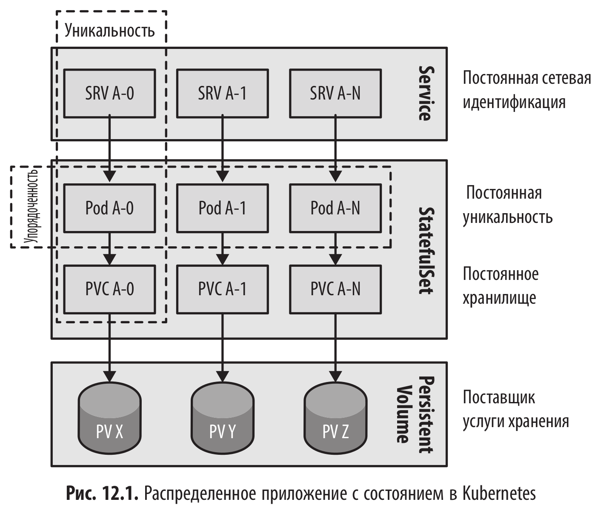

# Сервис с сохранением состояния (Stateful Service)

<br/>



<br/>

```shell
$ minikube start --mount --mount-string="$(pwd)/logs:/tmp/example"
```

<br/>

Let’s create now two PersistentVolumes for the replicas of our StatefulSet later:

<br/>

```yaml
$ cat << 'EOF' | kubectl apply -f -
# Persistent volume mapping a hostPath. Works only on 1-node clusters like Minikube
apiVersion: v1
kind: PersistentVolume
metadata:
  name: log-1
spec:
  accessModes:
    - ReadWriteOnce
  capacity:
    storage: 10Mi
  # Storageclass is important here otherwise the PVC won't bind
  storageClassName: standard
  hostPath:
    # Mount by Minikube from local directory during 'minikube start'
    path: /tmp/example/1
---
apiVersion: v1
kind: PersistentVolume
metadata:
  name: log-2
spec:
  accessModes:
    - ReadWriteOnce
  capacity:
    storage: 10Mi
  storageClassName: standard
  hostPath:
    path: /tmp/example/2
---
apiVersion: v1
kind: PersistentVolume
metadata:
  name: log-3
spec:
  accessModes:
    - ReadWriteOnce
  capacity:
    storage: 10Mi
  storageClassName: standard
  hostPath:
    path: /tmp/example/3
EOF
```

<br/>

```yaml
$ cat << 'EOF' | kubectl apply -f -
apiVersion: v1
kind: Service
metadata:
  name: random-generator
spec:
  clusterIP: None
  selector:
    app: random-generator
  ports:
    - name: http
      port: 8080
EOF
```

<br/>

```yaml
$ cat << 'EOF' | kubectl apply -f -
apiVersion: apps/v1
kind: StatefulSet
metadata:
  name: rg
spec:
  serviceName: random-generator
  replicas: 2
  selector:
    matchLabels:
      app: random-generator
  template:
    metadata:
      labels:
        app: random-generator
    spec:
      containers:
        - image: k8spatterns/random-generator:1.0
          name: random-generator
          env:
            - name: LOG_FILE
              value: /opt/logs/random.log
          ports:
            - containerPort: 8080
              name: http
          volumeMounts:
            - name: logs
              mountPath: /opt/logs
  volumeClaimTemplates:
    - metadata:
        name: logs
      spec:
        accessModes: ['ReadWriteOnce']
        resources:
          requests:
            storage: 10Mi
EOF
```

<br/>

```yaml
$ cat << 'EOF' | kubectl apply -f -
apiVersion: v1
kind: Service
metadata:
  name: random-generator-np
spec:
  selector:
    app: random-generator
  ports:
    - name: http
      port: 8080
      targetPort: 8080
  type: NodePort
EOF
```

<br/>

```shell
$ kubectl get pvc
```

<br/>

To access the service on Minikube, we need to start a tunnel to the VM and store the URL to the service in a text file that we pick up later.

<br/>

```shell
$ minikube service random-generator-np --url > /tmp/random-url.txt &
```

<br/>

```shell
$ url=$(cat /tmp/random-url.txt)

$ echo $url
http://192.168.58.2:32721

$ curl -s $url | jq .
```

<br/>

```shell
$ sudo chmod -R 777 ./logs/
```

<br/>

```shell
$ curl -s $url/logs
```

<br/>

```shell
$ curl -s $url | jq .
{
  "random": 170497038,
  "id": "eb3c62d0-90cd-4a64-9795-9442081812c5",
  "version": "1.0"
}
$ curl -s $url | jq .
{
  "random": 438615206,
  "id": "eb3c62d0-90cd-4a64-9795-9442081812c5",
  "version": "1.0"
}
$ curl -s $url | jq .
{
  "random": -2115340662,
  "id": "eb3c62d0-90cd-4a64-9795-9442081812c5",
  "version": "1.0"
}
$ curl -s $url | jq .
{
  "random": 1875051241,
  "id": "eb3c62d0-90cd-4a64-9795-9442081812c5",
  "version": "1.0"
}
```

<br/>

```shell
$ curl -s $url/logs
{"timestamp":"2026-04-10T23:21:25.169+00:00","status":404,"error":"Not Found","path":"/logs"}
```

<br/>

```shell
$ kubectl scale statefulset --replicas 1 rg
```

<br/>

```shell
$ kubectl get pvc
NAME        STATUS   VOLUME   CAPACITY   ACCESS MODES   STORAGECLASS   VOLUMEATTRIBUTESCLASS   AGE
logs-rg-0   Bound    log-3    10Mi       RWO            standard       <unset>                 15m
logs-rg-1   Bound    log-1    10Mi       RWO            standard       <unset>                 15m
```

<br/>

```shell
$ curl -s $url | jq .
$ curl -s $url | jq .
$ curl -s $url | jq .
$ curl -s $url | jq .
$ curl -s $url | jq .
$ curl -s $url | jq .
$ curl -s $url | jq .
$ curl -s $url | jq .
```

<br/>

```shell
$ kubectl scale statefulset --replicas 3 rg
```

<br/>

```shell
$ kubectl get pvc
NAME        STATUS   VOLUME   CAPACITY   ACCESS MODES   STORAGECLASS   VOLUMEATTRIBUTESCLASS   AGE
logs-rg-0   Bound    log-3    10Mi       RWO            standard       <unset>                 18m
logs-rg-1   Bound    log-1    10Mi       RWO            standard       <unset>                 18m
logs-rg-2   Bound    log-2    10Mi       RWO            standard       <unset>                 39s
```

<br/>

```shell
$ curl -s $url | jq .
$ curl -s $url | jq .
$ curl -s $url | jq .
$ curl -s $url | jq .
$ curl -s $url | jq .
$ curl -s $url | jq .
$ curl -s $url | jq .
$ curl -s $url | jq .
```

<br/>

```shell
$ kubectl exec -it rg-0 -- bash
I have no name!@rg-0:/opt$
```

<br/>

```shell
$ kubectl exec -it rg-0 -- bash
I have no name!@rg-0:/opt$
```

<br/>

```shell
I have no name!@rg-0:/opt$ dig SRV random-generator.default.svc.cluster.local
bash: dig: command not found
```

<br/>

```shell
$ kubectl run -i --tty --rm debug --image=registry.k8s.io/e2e-test-images/jessie-dnsutils:1.7 --restart=Never -- /bin/sh
```

<br/>

```shell
$ nslookup -type=SRV random-generator.default.svc.cluster.local
random-generator.default.svc.cluster.local	service = 0 33 8080 rg-0.random-generator.default.svc.cluster.local.
random-generator.default.svc.cluster.local	service = 0 33 8080 rg-1.random-generator.default.svc.cluster.local.
random-generator.default.svc.cluster.local	service = 0 33 8080 rg-2.random-generator.default.svc.cluster.local.
```

<br/>

```shell
$ minikube stop && minikube delete
```

<br/>

**Что этот вывод нам говорит (Разбор магии):**

1. Headless Service в действии: Вы видите три отдельные записи (rg-0, rg-1, rg-2). Если бы вы использовали обычный Service (не Headless), nslookup выдал бы вам только один виртуальный IP (ClusterIP).

2. Стабильные сетевые идентификаторы: В отличие от обычных Подов, чьи имена выглядят как random-generator-7f845..., здесь у каждого пода есть строгое имя и порядковый номер.

3. Прямая адресация: Любое другое приложение в кластере теперь может обратиться не просто к «какому-то рандомайзеру», а к конкретному экземпляру. Например, curl rg-0.random-generator:8080.

<br/>

**Почему это важно для паттернов:**

Этот механизм — фундамент для запуска баз данных (Cassandra, MongoDB, PostgreSQL) в Kubernetes. Им нужно знать, кто из них Master, а кто Replica, и уметь общаться друг с другом по стабильным именам, которые не меняются после перезагрузки пода.

Хотите проверить, что произойдет с этими именами, если вы удалите один из подов командой kubectl delete pod rg-0? (Спойлер: Kubernetes его пересоздаст с тем же самым именем и привяжет к тому же диску).

<br/><br/>

---

<br/>

<a href="https://k8s.ru/">Предложить инженеру работу / подработку на проекте с kubernetes, microservices, machine learning, big data, golang</a>
