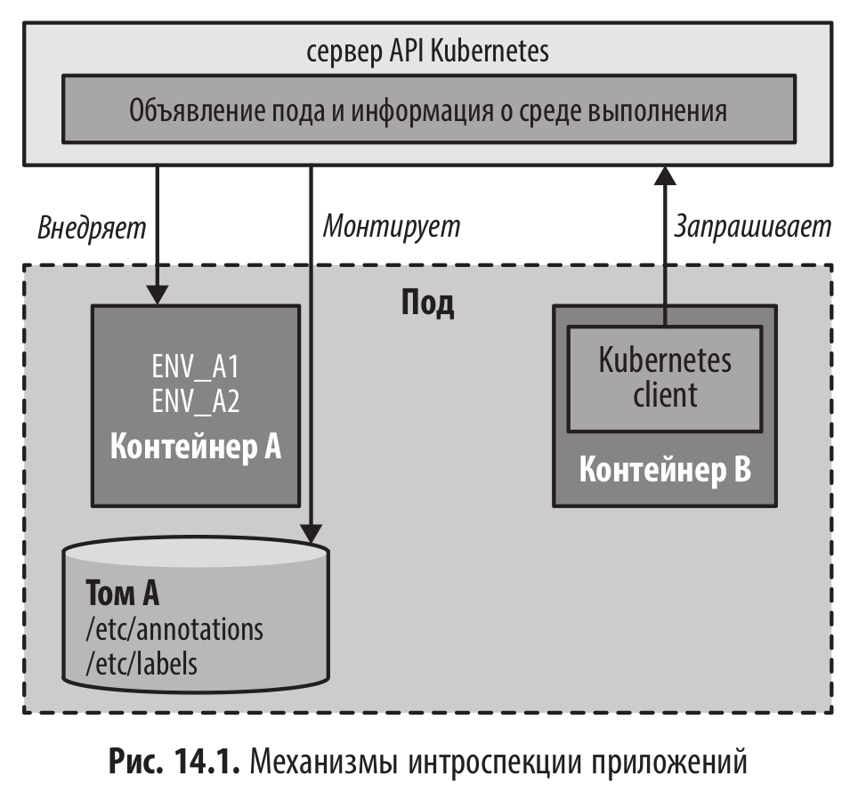

# Самоанализ (Self Awareness)

<br/>



<br/>

### Информация из Downward API (fieldRef.fieldPath)

<br/>

| Имя                         | Описание                                              |
| --------------------------- | ----------------------------------------------------- |
| spec.nodeName               | Имя узла, на котором запущен Pod.                     |
| status.hostIP               | IP-адрес узла, на котором запущен Pod.                |
| metadata.name               | Имя самого Pod'а.                                     |
| metadata.namespace          | Пространство имен (namespace), в котором запущен Pod. |
| status.podIP                | Внутренний IP-адрес Pod'а.                            |
| spec.serviceAccountName     | Имя ServiceAccount, используемого Pod'ом.             |
| metadata.uid                | Уникальный идентификатор (UID) Pod'а.                 |
| metadata.labels['key']      | Значение конкретной метки (label) с ключом key.       |
| metadata.annotations['key'] | Значение конкретной аннотации с ключом key.           |

<br/>

### Параметры ресурсов в Kubernetes

| Имя                        | Описание                                                                                   |
| -------------------------- | ------------------------------------------------------------------------------------------ |
| limits.memory              | Лимит памяти, доступной контейнеру.                                                        |
| requests.hugepages-<size>  | Размер страниц памяти HugePages, запрошенный контейнером (пример: requests.hugepages-1Gi). |
| limits.hugepages-<size>    | Лимит страниц памяти HugePages, доступный контейнеру (пример: limits.hugepages-1Gi).       |
| requests.ephemeral-storage | Размер временного хранилища, запрошенный контейнером.                                      |
| limits.ephemeral-storage   | Лимит временного хранилища, доступный контейнеру.                                          |
| requests.cpu               | Количество CPU, запрошенное контейнером (в ядрах или millicores).                          |
| limits.cpu                 | Максимальное количество CPU, которое может использовать контейнер.                         |
| requests.memory            | Объем памяти, гарантированный контейнеру при запуске.                                      |

<br/>

### Разбор примеров из книги

<br/>

Чтобы сфокусироваться на использовании Downward API, создадим Pod, который пробрасывает собственные свойства в переменные окружения и монтирует метки (labels) и аннотации (annotations) в виде файлов.

<br/>

```shell
$ minikube start
```

<br/>

```yaml
$ cat << 'EOF' | kubectl apply -f -
apiVersion: v1
kind: Pod
metadata:
  name: random-generator
  labels:
    app: random-generator
spec:
  containers:
    - image: k8spatterns/random-generator:1.0
      name: random-generator
      env:
        - name: PATTERN
          value: Self Awareness
        # The Downward API allows access to fields
        # in this declaration
        - name: POD_IP
          valueFrom:
            fieldRef:
              fieldPath: status.podIP
        - name: NODE_NAME
          valueFrom:
            fieldRef:
              fieldPath: spec.nodeName
      volumeMounts:
        - name: pod-info
          mountPath: /pod-info
      ports:
        - containerPort: 8080
          protocol: TCP
  volumes:
    - name: pod-info
      downwardAPI:
        items:
          - path: labels
            fieldRef:
              fieldPath: metadata.labels
          - path: annotations
            fieldRef:
              fieldPath: metadata.annotations
EOF
```

<br/>

```shell
$ kubectl port-forward random-generator 8080:8080
```

<br/>

```shell
$ curl -s http://localhost:8080/info | jq .
{
  "memory.free": 66,
  "NODE_NAME": "minikube",
  "memory.used": 154,
  "cpu.procs": 4,
  "memory.max": 3964,
  "pattern": "Self Awareness",
  "annotations": "kubectl.kubernetes.io/last-applied-configuration=\"{\\\"apiVersion\\\":\\\"v1\\\",\\\"kind\\\":\\\"Pod\\\",\\\"metadata\\\":{\\\"annotations\\\":{},\\\"labels\\\":{\\\"app\\\":\\\"random-generator\\\"},\\\"name\\\":\\\"random-generator\\\",\\\"namespace\\\":\\\"default\\\"},\\\"spec\\\":{\\\"containers\\\":[{\\\"env\\\":[{\\\"name\\\":\\\"PATTERN\\\",\\\"value\\\":\\\"Self Awareness\\\"},{\\\"name\\\":\\\"POD_IP\\\",\\\"valueFrom\\\":{\\\"fieldRef\\\":{\\\"fieldPath\\\":\\\"status.podIP\\\"}}},{\\\"name\\\":\\\"NODE_NAME\\\",\\\"valueFrom\\\":{\\\"fieldRef\\\":{\\\"fieldPath\\\":\\\"spec.nodeName\\\"}}}],\\\"image\\\":\\\"k8spatterns/random-generator:1.0\\\",\\\"name\\\":\\\"random-generator\\\",\\\"ports\\\":[{\\\"containerPort\\\":8080,\\\"protocol\\\":\\\"TCP\\\"}],\\\"volumeMounts\\\":[{\\\"mountPath\\\":\\\"/pod-info\\\",\\\"name\\\":\\\"pod-info\\\"}]}],\\\"volumes\\\":[{\\\"downwardAPI\\\":{\\\"items\\\":[{\\\"fieldRef\\\":{\\\"fieldPath\\\":\\\"metadata.labels\\\"},\\\"path\\\":\\\"labels\\\"},{\\\"fieldRef\\\":{\\\"fieldPath\\\":\\\"metadata.annotations\\\"},\\\"path\\\":\\\"annotations\\\"}]},\\\"name\\\":\\\"pod-info\\\"}]}}\\n\"\nkubernetes.io/config.seen=\"2026-04-13T03:08:43.505066403Z\"\nkubernetes.io/config.source=\"api\"",
  "id": "366530d2-9f40-4c1f-bcac-1f8a4b808a04",
  "POD_IP": "10.244.0.3",
  "env": {
    "LANGUAGE": "en_US:en",
    "KUBERNETES_PORT_443_TCP": "tcp://10.96.0.1:443",
    "PATH": "/opt/java/openjdk/bin:/usr/local/sbin:/usr/local/bin:/usr/sbin:/usr/bin:/sbin:/bin",
    "KUBERNETES_PORT_443_TCP_ADDR": "10.96.0.1",
    "KUBERNETES_PORT": "tcp://10.96.0.1:443",
    "JAVA_HOME": "/opt/java/openjdk",
    "KUBERNETES_PORT_443_TCP_PROTO": "tcp",
    "LANG": "en_US.UTF-8",
    "KUBERNETES_SERVICE_HOST": "10.96.0.1",
    "KUBERNETES_SERVICE_PORT": "443",
    "NODE_NAME": "minikube",
    "PATTERN": "Self Awareness",
    "HOSTNAME": "random-generator",
    "LC_ALL": "en_US.UTF-8",
    "KUBERNETES_PORT_443_TCP_PORT": "443",
    "JAVA_VERSION": "jdk-17.0.9+9",
    "KUBERNETES_SERVICE_PORT_HTTPS": "443",
    "POD_IP": "10.244.0.3",
    "HOME": "/"
  },
  "version": "1.0",
  "labels": "app=\"random-generator\""
}
```

<br/>

```shell
$ patch=$(cat <<EOT
[
  {
    "op": "add",
    "path": "/metadata/labels",
    "value": {
      "app": "random-generator-updated"
    }
  }
]
EOT
)
```

<br/>

```shell
$ kubectl patch pod random-generator --type=json -p="$patch"
```

<br/>

```shell
$ curl -s http://localhost:8080/info | jq .
{
  "memory.free": 61,
  "NODE_NAME": "minikube",
  "memory.used": 154,
  "cpu.procs": 4,
  "memory.max": 3964,
  "pattern": "Self Awareness",
  "annotations": "kubectl.kubernetes.io/last-applied-configuration=\"{\\\"apiVersion\\\":\\\"v1\\\",\\\"kind\\\":\\\"Pod\\\",\\\"metadata\\\":{\\\"annotations\\\":{},\\\"labels\\\":{\\\"app\\\":\\\"random-generator\\\"},\\\"name\\\":\\\"random-generator\\\",\\\"namespace\\\":\\\"default\\\"},\\\"spec\\\":{\\\"containers\\\":[{\\\"env\\\":[{\\\"name\\\":\\\"PATTERN\\\",\\\"value\\\":\\\"Self Awareness\\\"},{\\\"name\\\":\\\"POD_IP\\\",\\\"valueFrom\\\":{\\\"fieldRef\\\":{\\\"fieldPath\\\":\\\"status.podIP\\\"}}},{\\\"name\\\":\\\"NODE_NAME\\\",\\\"valueFrom\\\":{\\\"fieldRef\\\":{\\\"fieldPath\\\":\\\"spec.nodeName\\\"}}}],\\\"image\\\":\\\"k8spatterns/random-generator:1.0\\\",\\\"name\\\":\\\"random-generator\\\",\\\"ports\\\":[{\\\"containerPort\\\":8080,\\\"protocol\\\":\\\"TCP\\\"}],\\\"volumeMounts\\\":[{\\\"mountPath\\\":\\\"/pod-info\\\",\\\"name\\\":\\\"pod-info\\\"}]}],\\\"volumes\\\":[{\\\"downwardAPI\\\":{\\\"items\\\":[{\\\"fieldRef\\\":{\\\"fieldPath\\\":\\\"metadata.labels\\\"},\\\"path\\\":\\\"labels\\\"},{\\\"fieldRef\\\":{\\\"fieldPath\\\":\\\"metadata.annotations\\\"},\\\"path\\\":\\\"annotations\\\"}]},\\\"name\\\":\\\"pod-info\\\"}]}}\\n\"\nkubernetes.io/config.seen=\"2026-04-13T03:08:43.505066403Z\"\nkubernetes.io/config.source=\"api\"",
  "id": "366530d2-9f40-4c1f-bcac-1f8a4b808a04",
  "POD_IP": "10.244.0.3",
  "env": {
    "LANGUAGE": "en_US:en",
    "KUBERNETES_PORT_443_TCP": "tcp://10.96.0.1:443",
    "PATH": "/opt/java/openjdk/bin:/usr/local/sbin:/usr/local/bin:/usr/sbin:/usr/bin:/sbin:/bin",
    "KUBERNETES_PORT_443_TCP_ADDR": "10.96.0.1",
    "KUBERNETES_PORT": "tcp://10.96.0.1:443",
    "JAVA_HOME": "/opt/java/openjdk",
    "KUBERNETES_PORT_443_TCP_PROTO": "tcp",
    "LANG": "en_US.UTF-8",
    "KUBERNETES_SERVICE_HOST": "10.96.0.1",
    "KUBERNETES_SERVICE_PORT": "443",
    "NODE_NAME": "minikube",
    "PATTERN": "Self Awareness",
    "HOSTNAME": "random-generator",
    "LC_ALL": "en_US.UTF-8",
    "KUBERNETES_PORT_443_TCP_PORT": "443",
    "JAVA_VERSION": "jdk-17.0.9+9",
    "KUBERNETES_SERVICE_PORT_HTTPS": "443",
    "POD_IP": "10.244.0.3",
    "HOME": "/"
  },
  "version": "1.0",
  "labels": "app=\"random-generator-updated\""
}
```

<br/>

Захожу в pod

<br/>

```shell
$ pwd
/pod-info
```

<br/>

```shell
$ cat labels
app="random-generator-updated"
```

<br/>

```shell
$ cat annotations
kubectl.kubernetes.io/last-applied-configuration="{\"apiVersion\":\"v1\",\"kind\":\"Pod\",\"metadata\":{\"annotations\":{},\"labels\":{\"app\":\"random-generator\"},\"name\":\"random-generator\",\"namespace\":\"default\"},\"spec\":{\"containers\":[{\"env\":[{\"name\":\"PATTERN\",\"value\":\"Self Awareness\"},{\"name\":\"POD_IP\",\"valueFrom\":{\"fieldRef\":{\"fieldPath\":\"status.podIP\"}}},{\"name\":\"NODE_NAME\",\"valueFrom\":{\"fieldRef\":{\"fieldPath\":\"spec.nodeName\"}}}],\"image\":\"k8spatterns/random-generator:1.0\",\"name\":\"random-generator\",\"ports\":[{\"containerPort\":8080,\"protocol\":\"TCP\"}],\"volumeMounts\":[{\"mountPath\":\"/pod-info\",\"name\":\"pod-info\"}]}],\"volumes\":[{\"downwardAPI\":{\"items\":[{\"fieldRef\":{\"fieldPath\":\"metadata.labels\"},\"path\":\"labels\"},{\"fieldRef\":{\"fieldPath\":\"metadata.annotations\"},\"path\":\"annotations\"}]},\"name\":\"pod-info\"}]}}\n"
kubernetes.io/config.seen="2026-04-13T03:08:43.505066403Z"
kubernetes.io/config.source="api"
```

<br/><br/>

---

<br/>

<a href="https://k8s.ru/">Предложить инженеру работу / подработку на проекте с kubernetes, microservices, machine learning, big data, golang</a>
