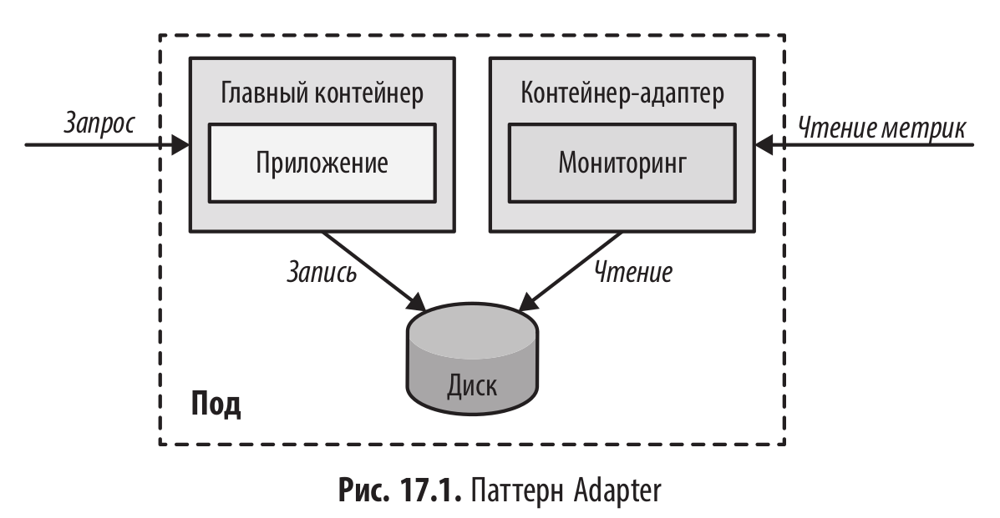

# Адаптер (Adapter)

<br/>



<br/>

### Разбор примеров из книги

<br/>

В этом примере мы разберем, как представить метрики, созданные REST-сервисом «генератор случайных чисел», в формате, совместимом с Prometheus.

По задумке, метрики этого сервиса записываются в формате, который Prometheus не может использовать напрямую. Кроме того, они не передаются через сетевой порт, а записываются в файловую систему. Мы используем sidecar-контейнер (адаптер), чтобы преобразовать данные из этого проприетарного формата и открыть к ним доступ по HTTP — так Prometheus сможет их собрать.

<br/>

```shell
$ minikube start --mount --mount-string="$(pwd)/logs:/tmp/logs"
```

<br/>

```yaml
$ cat << 'EOF' | kubectl apply -f -
# Example for the Adapter patterns, which transform custom metrics
# stored on the file system into a Prometheus conformant export
# on port 9889
apiVersion: v1
kind: Pod
metadata:
  name: random-generator
  labels:
    app: random-generator
spec:
  containers:
    # ------------------------------------------------
    # Main application
    - image: k8spatterns/random-generator:1.0
      name: main
      env:
        # The log file that we want to export
        - name: LOG_FILE
          value: /tmp/logs/random.log
      ports:
        # Application running on port 8080
        - containerPort: 8080
          protocol: TCP
      volumeMounts:
        - mountPath: /tmp/logs
          name: log-volume
    # ------------------------------------------------
    # Prometheus adapter. You find the source to this image
    # in the "image/" directory.
    - image: k8spatterns/random-generator-exporter
      name: adapter
      env:
        # Logfile to pick up by exporter script
        - name: LOG_FILE
          value: /tmp/logs/random.log
      ports:
        # Expose prometheus metrics via that port
        - containerPort: 9889
          protocol: TCP
      # Mount shared volume for accessing the logs
      volumeMounts:
        - mountPath: /tmp/logs
          name: log-volume
  volumes:
    # New empty directory volume for sharing the log file between container
    - name: log-volume
      emptyDir: {}
EOF
```

<br/>

```yaml
$ cat << 'EOF' | kubectl apply -f -
apiVersion: v1
kind: Service
metadata:
  name: random-generator
spec:
  selector:
    app: random-generator
  ports:
    # Random service is reachable on port 8080
    - name: random
      port: 8080
      protocol: TCP
      targetPort: 8080
    # Export prometheus conform data over port 9889
    - name: prometheus
      port: 9889
      protocol: TCP
      targetPort: 9889
  # Type NodePort for being able to directly access the service from outside the cluster
  # Use "kubectl get svc random-generator -o jsonpath={.spec.ports[0].nodePort}" to find out
  # the dynamically assigned port
  type: NodePort
EOF
```

<br/>

```shell
$ kubectl get pod random-generator -o jsonpath='{.spec.containers[*].name}'
main adapter
```

<br/>

```shell
$ kubectl get svc
NAME               TYPE        CLUSTER-IP      EXTERNAL-IP   PORT(S)                         AGE
kubernetes         ClusterIP   10.96.0.1       <none>        443/TCP                         76s
random-generator   NodePort    10.103.123.20   <none>        8080:31590/TCP,9889:31992/TCP   53s
```

<br/>

```shell
$ minikube ip
192.168.58.2
```

<br/>

```shell
$ port=$(kubectl get svc random-generator -o jsonpath='{.spec.ports[0].nodePort}')
```

<br/>

```shell
$ echo ${port}
31590
```

<br/>

```shell
$ curl 192.168.58.2:${port}
{"random":1298163778,"id":"056484d3-a648-41fa-9203-f470dd03e997","version":"1.0"}
```

<br/>

```shell
$ kubectl exec -it random-generator -c main -- bash
```

<br/>

```shell
$ cat /tmp/logs/random.log
03:50:25.604,056484d3-a648-41fa-9203-f470dd03e997,31732,1298163778
```

<br/>

```shell
$ minikube_ip=$(minikube ip)
$ port=$(kubectl get svc random-generator -o jsonpath='{.spec.ports[0].nodePort}')
```

<br/>

```shell
$ curl ${minikube_ip}:${port}
random_generator_count 1
random_generator_seconds_total 3.1732e-05
```

<br/>

```shell
$ minikube stop && minikube delete
```

<br/>

Этот пример наглядно демонстрирует паттерн Adapter (Адаптер) в действии. Основная идея здесь — привести нестандартный интерфейс приложения к единому стандарту, принятому в вашей инфраструктуре (в данном случае — к формату Prometheus), не меняя код самого приложения.

Вы получили систему, где мониторинг «не знает» об особенностях приложения, а приложение «не знает» о существовании Prometheus. Адаптер служит идеальной прослойкой.

<br/><br/>

---

<br/>

<a href="https://k8s.ru/">Предложить инженеру работу / подработку на проекте с kubernetes, microservices, machine learning, big data, golang</a>
