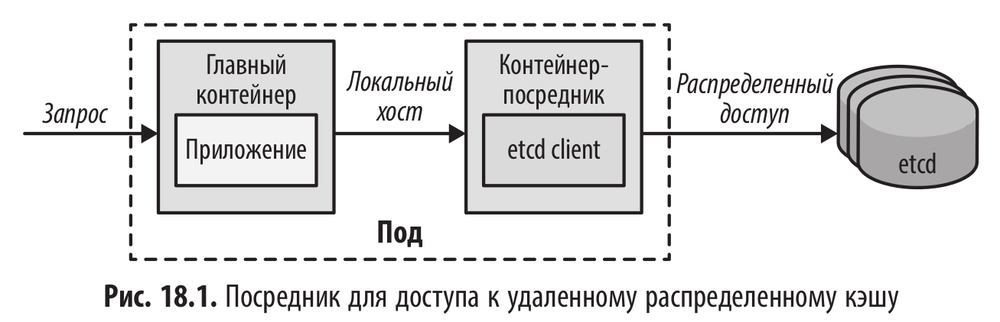
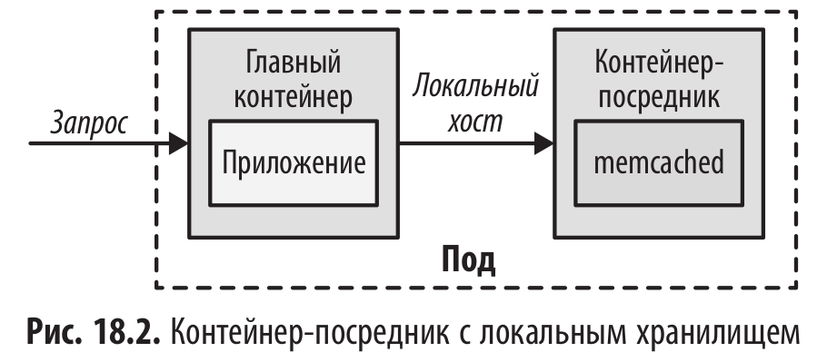

# Посредник (Ambassador)

<br/>



<br/>



<br/>

## Разбор примеров из книги

<br/>

В данном примере мы создадим простой ambassador (амбассадор), который абстрагирует бэкенд для логирования. Основной сервис «генератор случайных чисел» логирует каждый входящий запрос, отправляя сгенерированные данные на URL, указанный в переменной окружения LOG_URL. Мы используем этот LOG_URL для подключения к амбассадору, который слушает localhost на порту 9009. Амбассадор отвечает за пересылку данных логов в соответствующий сервис логирования.

Для простоты мы используем базовый амбассадор, который выводит данные в стандартный поток вывода (stdout). Этот амбассадор использует простой HTTP-сервер на Node.js внутри образа k8spatterns/random-generator-log-ambassador.

<br/>

```shell
$ minikube start
```

<br/>

Чтобы предотвратить ошибку **failed to create fsnotify watcher: too many open files**

```shell
$ sudo sysctl fs.inotify.max_user_instances=8192
$ sudo sysctl fs.inotify.max_user_watches=524288
```

<br/>

```yaml
$ cat << 'EOF' | kubectl apply -f -
# DeploymentConfig for starting up the random-generator
apiVersion: v1
kind: Pod
metadata:
  name: random-generator
  labels:
    app: random-generator
spec:
  containers:
    # ------------------------------------------------
    # Main application
    - image: k8spatterns/random-generator:1.0
      name: main
      env:
        # URL to the port our ambassador is listening.
        - name: LOG_URL
          value: http://localhost:9009
      ports:
        # Application running on port 8080
        - containerPort: 8080
          protocol: TCP
    # ------------------------------------------------
    # Ambassador used for logging out
    - image: k8spatterns/random-generator-log-ambassador
      name: ambassador
EOF
```

<br/>

```yaml
$ cat << 'EOF' | kubectl apply -f -
apiVersion: v1
kind: Service
metadata:
  name: random-generator
spec:
  selector:
    app: random-generator
  ports:
    - name: http
      port: 8080
      protocol: TCP
      targetPort: 8080
  type: NodePort
EOF
```

<br/>

```shell
$ kubectl get pod random-generator -o jsonpath='{.spec.containers[*].name}'
main ambassador
```

<br/>

```shell
$ kubectl get svc
NAME               TYPE        CLUSTER-IP     EXTERNAL-IP   PORT(S)          AGE
kubernetes         ClusterIP   10.96.0.1      <none>        443/TCP          2m42s
random-generator   NodePort    10.101.76.50   <none>        8080:31623/TCP   2m5s
```

<br/>

```shell
$ minikube_ip=$(minikube ip)
$ port=$(kubectl get svc random-generator -o jsonpath='{.spec.ports[0].nodePort}')
```

<br/>

```shell
$ curl ${minikube_ip}:${port} | jq
{
  "timestamp": "2026-04-15T04:32:49.281+00:00",
  "status": 500,
  "error": "Internal Server Error",
  "path": "/"
}
```

<br/>

```shell
$ kubectl logs -f random-generator -c ambassador
==========================================
Starting up random-generator Ambassador
Listening at http://localhost:9009
==========================================
```

<br/>

```shell
$ kubectl logs -f random-generator -c main
***
java exception
***
```

<br/>

```shell
$ kubectl delete pod random-generator
```

<br/>

```yaml
$ cat << 'EOF' | kubectl apply -f -
apiVersion: v1
kind: Pod
metadata:
  name: random-generator
  labels:
    app: random-generator
spec:
  containers:
    - image: k8spatterns/random-generator:1.0
      name: main
      env:
        - name: LOG_URL
          value: http://[::1]:9009
      ports:
        - containerPort: 8080
          protocol: TCP
    - image: k8spatterns/random-generator-log-ambassador
      name: ambassador
EOF
```

<br/>

```shell
$ curl ${minikube_ip}:${port} | jq
{
  "random": 1267957630,
  "id": "cdb2de66-853d-45b4-ad7b-e3acb68b5d61",
  "version": "1.0"
}

$ curl ${minikube_ip}:${port} | jq
$ curl ${minikube_ip}:${port} | jq
$ curl ${minikube_ip}:${port} | jq
$ curl ${minikube_ip}:${port} | jq
```

<br/>

```shell
$ kubectl logs random-generator -c ambassador
==========================================
Starting up random-generator Ambassador
Listening at http://localhost:9009
==========================================
Message received for processing:
>>> ID: cdb2de66-853d-45b4-ad7b-e3acb68b5d61 -- Duration: 30872 -- Random: 1267957630
Message received for processing:
>>> ID: cdb2de66-853d-45b4-ad7b-e3acb68b5d61 -- Duration: 10585 -- Random: -803757597
Message received for processing:
>>> ID: cdb2de66-853d-45b4-ad7b-e3acb68b5d61 -- Duration: 12007 -- Random: -368807638
Message received for processing:
>>> ID: cdb2de66-853d-45b4-ad7b-e3acb68b5d61 -- Duration: 18489 -- Random: 209038043
Message received for processing:
>>> ID: cdb2de66-853d-45b4-ad7b-e3acb68b5d61 -- Duration: 9707 -- Random: 109185791
```

<br/>

```shell
$ minikube stop && minikube delete
```

<br/><br/>

---

<br/>

<a href="https://k8s.ru/">Предложить инженеру работу / подработку на проекте с kubernetes, microservices, machine learning, big data, golang</a>
