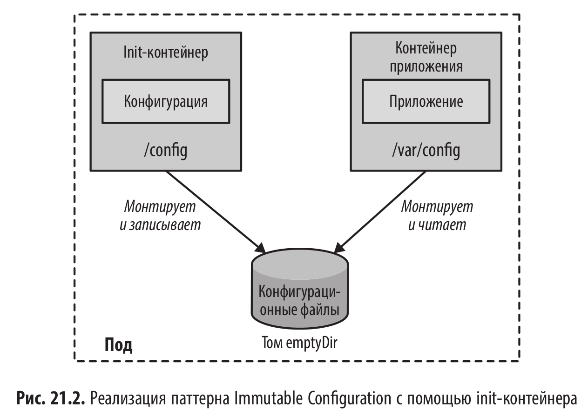

# Неизменяемая конфигурация (Immutable Configuration)

<br/>



<br/>

## Разбор примеров из книги

<br/>

### Сборка war файла (Можно пропустить)

<br/>

```shell
$ cd demo
```

<br/>

```shell
$ docker build -t k8s-demo .
```

<br/>

```shell
$ docker create --name temp-container k8s-demo
$ docker cp temp-container:/app/target/demo.war ./demo.war
$ docker rm temp-container
$ cp demo.war ../init-container/
```

<br/>

### Docker Volumes to link configuration containers (Пропустил)

https://github.com/k8spatterns/examples/blob/main/configuration/ImmutableConfiguration/docker-volumes/README.adoc

<br/>

### Init Containers for Linking Configuration Containers

<br/>

```shell
$ minikube start
```

<br/>

```shell
$ eval $(minikube docker-env)
```

<br/>

```shell
$ cd init-container
```

<br/>

```shell
$ docker build -t k8spatterns/demo:1 -f Dockerfile-demo .
```

<br/>

```shell
$ docker build --build-arg config=dev.properties -f Dockerfile-config -t k8spatterns/config-dev:1 .
```

<br/>

```shell
$ docker build --build-arg config=prod.properties -f Dockerfile-config -t k8spatterns/config-prod:1 .
```

<br/>

```yaml
$ cat << 'EOF' | kubectl apply -f -
# Example Deployment using a config map as input for a template
# which is processed from an init-container
---
apiVersion: apps/v1
kind: Deployment
metadata:
  labels:
    project: k8spatterns
    pattern: ImmutableConfiguration
  name: demo
spec:
  replicas: 1
  selector:
    matchLabels:
      pattern: ImmutableConfiguration
  template:
    metadata:
      labels:
        project: k8spatterns
        pattern: ImmutableConfiguration
    spec:
      initContainers:
        # The init container holding our configuration. For switching to production
        # you need to exchange this configuration image with the production variant
        - image: k8spatterns/config-dev:1
          name: init
          imagePullPolicy: IfNotPresent
          args:
            # Target directory where to copy the configuration into:
            - '/config'
          volumeMounts:
            # Mount the shared directory
            - mountPath: '/config'
              name: config-directory
      containers:
        # The application to start and exposing a port at 8080
        - image: k8spatterns/demo:1
          name: demo
          imagePullPolicy: IfNotPresent
          ports:
            - containerPort: 8080
              name: http
              protocol: TCP
          # Mount the volume to which the init-container has written
          # the configuration:
          volumeMounts:
            - mountPath: '/config'
              name: config-directory
      volumes:
        # Empty directory used to share the configuration information
        - name: config-directory
          emptyDir: {}
---
apiVersion: v1
kind: Service
metadata:
  labels:
    project: k8spatterns
    pattern: ImmutableConfiguration
  name: demo
spec:
  ports:
    - name: http
      port: 8080
      protocol: TCP
      targetPort: 8080
  selector:
    pattern: ImmutableConfiguration
  # Just for demo
  type: NodePort
EOF
```

<br/>

```
$ minikube service demo
┌───────────┬──────┬─────────────┬───────────────────────────┐
│ NAMESPACE │ NAME │ TARGET PORT │            URL            │
├───────────┼──────┼─────────────┼───────────────────────────┤
│ default   │ demo │ http/8080   │ http://192.168.58.2:30786 │
└───────────┴──────┴─────────────┴───────────────────────────┘
```

<br/>


<br/>

```shell
$ kubectl patch deployment demo --type json -p \
  '[ {"op" : "replace", "path": "/spec/template/spec/initContainers/0/image", "value": "k8spatterns/config-prod:1"}]'
```

<br/>


<br/>

```shell
$ minikube stop && minikube delete
```

<br/>

### Пример с OpenShift Template

Нет желания разбираться с OpenShift

<br/><br/>

---

<br/>

<a href="https://k8s.ru/">Предложить инженеру работу / подработку на проекте с kubernetes, microservices, machine learning, big data, golang</a>
