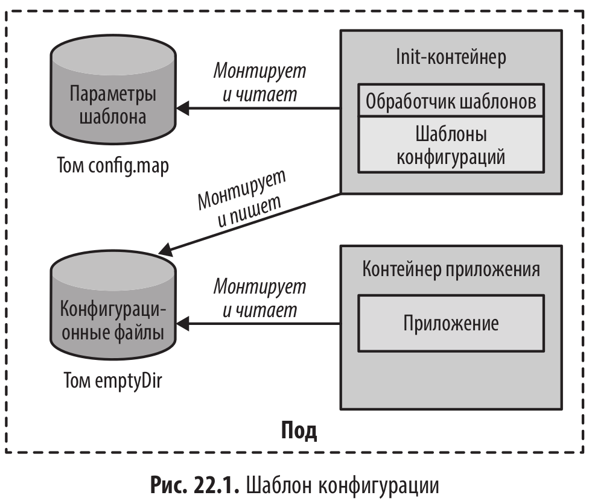

# Шаблон конфигурации (Configuration Template)

<br/>

Идея - хранить в переменных среды только различающиеся значенияn конфигурации, такие как параметры подключения к базе данных.

На рис показан пример шаблона конфигурации, в который поступают данные из переменных среды или монтированного тома, возможно, основанного на ConfigMap.

<br/>



В этом случае во время запуска пода выполняются следующие шаги:

1. Init-контейнер запускается и вызывает обработчик шаблонов. Обработчик извлекает шаблоны из своего образа и параметры из монтированного тома ConfigMap и сохраняет результат в томе emptyDir.

2. После завершения init-контейнера запускается контейнер приложения и загружает файлы конфигурации из тома emptyDir.

<br/>

## Разбор примеров из книги

<br/>

```shell
$ minikube start
```

<br/>

Если запустить развертывание, произойдет следующее:

- Будет создан init-контейнер и выполнится определяемая им команда. Этот контейнер извлечет файл config.yml из тома ConfigMap, заполнит шаблоны из
  каталога /in в init-контейнере и сохранит получившиеся файлы в каталоге /out.
  Каталог /out — это точка монтирования тома wildfly-config.

- После того как init-контейнер завершится, будет запущен сервер WildFly с параметром, указывающим, что полная конфигурация находится в каталоге /config — общем томе wildfly-config, содержащем обработанные файлы шаблона.

Важно отметить, что это описание ресурса развертывания Deployment не придется изменять при переносе приложения из среды разработки в рабочую среду. Изменить понадобится только ConfigMap с параметрами шаблона.

<br/>

```shell
$ kubectl create configmap dev-params --from-file=dev
```

<br/>

```shell
$ kubectl create configmap prod-params --from-file=prod
```

<br/>

```yaml
$ cat << 'EOF' | kubectl apply -f -
# Example Deployment using a config map as input for a template
# which is processed from an init-container
---
apiVersion: v1
kind: List
items:
  - apiVersion: apps/v1
    kind: Deployment
    metadata:
      labels:
        app: wildfly
        project: k8spatterns
        pattern: ConfigurationTemplate
      name: wildfly
    spec:
      replicas: 1
      selector:
        matchLabels:
          pattern: ConfigurationTemplate
      template:
        metadata:
          labels:
            project: k8spatterns
            app: wildfly
            pattern: ConfigurationTemplate
        spec:
          initContainers:
            # The init container is responsible for processing configuration
            # templates.
            # The init image expects the following mount setup:
            # - /params -- A directory containing yaml files for the parameters
            #              to fill in the template
            # - /out -- Directory to which the processed templates are written.
            # The templates themselves are contained within the
            # image container in the director "/in". The parameters come
            # from a volume mounted configmap, the output goes
            # to a emptyDir shared pod volume.
            - image: k8spatterns/example-configuration-template-init
              name: init
              args:
                # Directory where the processed configurations files should be put in
                - '--output-dir=/out'
                # The replacement parameters are picked up from a file that is defined
                # in the mounted config map
                - '--datasource=config=/params/config.yml'
              volumeMounts:
                - mountPath: '/params'
                  name: wildfly-params
                - mountPath: '/out'
                  name: wildfly-config
          containers:
            - image: quay.io/wildfly/wildfly:27.0.0.Final-jdk17
              name: server
              command:
                # Use a special configuration directory holding our processed
                # configuration templates:
                - '/opt/jboss/wildfly/bin/standalone.sh'
                - '-Djboss.server.config.dir=/config'
              ports:
                - containerPort: 8080
                  name: http
                  protocol: TCP
              # Mount the volume to which the init-container has written
              # the processed templates:
              volumeMounts:
                - mountPath: '/config'
                  name: wildfly-config
          volumes:
            # Volume holding the template parameters as config maps. The map
            # is supposed to hold a file 'config.yml' with is a yaml document
            # with the following keys:
            # - logFormat : Log line to use for Wildfly logoutput
            - name: wildfly-params
              configMap:
                # Use developer parameters by default, will be patched later
                # to switch to prod-params
                name: dev-params
            # Node and Pod specific directory used to share the processed temlates
            # between the init container who created it and the the
            # server who picks it up during startup
            - name: wildfly-config
              emptyDir: {}
  # A service which opens a NodePort is added for your convenience
  # but is not necessarily required for this example:
  - apiVersion: v1
    kind: Service
    metadata:
      labels:
        project: k8spatterns
        pattern: ConfigurationTemplate
      name: wildfly
    spec:
      ports:
        - name: http
          port: 8080
          protocol: TCP
          targetPort: 8080
      selector:
        project: k8spatterns
        pattern: ConfigurationTemplate
      # Just for demo
      type: NodePort
EOF
```

<br/>

```shell
$ kubectl logs -f $(kubectl get pod -l app=wildfly -o name) server
DEVELOPMENT: 03:22:35,410 INFO  [org.jboss.as.server] (Controller Boot Thread) WFLYSRV0212: Resuming server
DEVELOPMENT: 03:22:35,412 INFO  [org.jboss.as] (Controller Boot Thread) WFLYSRV0025: WildFly Full 27.0.0.Final (WildFly Core 19.0.0.Final) started in 2792ms - Started 290 of 563 services (357 services are lazy, passive or on-demand) - Server configuration file in use: standalone.xml
DEVELOPMENT: 03:22:35,414 INFO  [org.jboss.as] (Controller Boot Thread) WFLYSRV0060: Http management interface listening on http://127.0.0.1:9990/management
DEVELOPMENT: 03:22:35,414 INFO  [org.jboss.as] (Controller Boot Thread) WFLYSRV0051: Admin console listening on http://127.0.0.1:9990
```

<br/>

```shell
$ kubectl patch deployment wildfly \
  -p '{"spec": {"template": {"spec": {"volumes": [{"name": "wildfly-params", "configMap": {"name": "prod-params"}}]}}}}'
```

<br/>

```shell
$ kubectl logs -f $(kubectl get pod -l app=wildfly -o name) server
PRODUCTION: 03:23:53,415 INFO  [org.jboss.ws.common.management] (MSC service thread 1-2) JBWS022052: Starting JBossWS 6.1.0.Final (Apache CXF 3.5.2.jbossorg-3)
PRODUCTION: 03:23:53,651 INFO  [org.jboss.as.server] (Controller Boot Thread) WFLYSRV0212: Resuming server
PRODUCTION: 03:23:53,653 INFO  [org.jboss.as] (Controller Boot Thread) WFLYSRV0025: WildFly Full 27.0.0.Final (WildFly Core 19.0.0.Final) started in 3356ms - Started 290 of 563 services (357 services are lazy, passive or on-demand) - Server configuration file in use: standalone.xml
PRODUCTION: 03:23:53,660 INFO  [org.jboss.as] (Controller Boot Thread) WFLYSRV0060: Http management interface listening on http://127.0.0.1:9990/management
PRODUCTION: 03:23:53,662 INFO  [org.jboss.as] (Controller Boot Thread) WFLYSRV0051: Admin console listening on http://127.0.0.1:9990
```

<br/>

```shell
$ minikube stop && minikube delete
```

<br/><br/>

---

<br/>

<a href="https://k8s.ru/">Предложить инженеру работу / подработку на проекте с kubernetes, microservices, machine learning, big data, golang</a>
