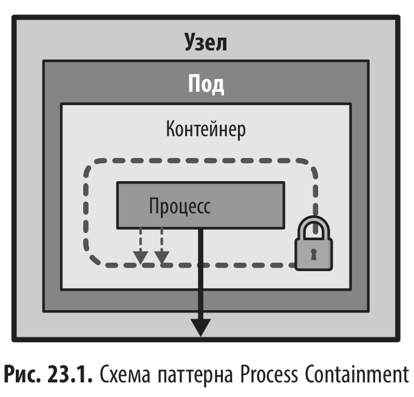

# Ограничение процессов (Process Containment) - Способы ограничения прав и привилегий процессов

<br/>



<br/>

Контроллеры Pod Security Standards (PSS) и Pod Security Admission (PSA) позволяют гарантировать, что набор подов соответствует определенным стандартам безопасности.

PSS определяет общую концепцию и понятия политик безопасности, а PSA помогает их применять.

<br/>

**Политики сгруппированы в три профиля безопасности:**

- Privileged - Профиль с максимальным уровнем разрешений. Он не накладывает ограничений, позволяя выполнять любые действия, и предназначен для системных или доверенных рабочих нагрузок.

- Baseline - Этот профиль предназначен для обычных некритических рабочих нагрузок. Он обеспечивает баланс между простотой применения и ограничениями возможностей повышения привилегий. Например, он не разрешает привилегированные контейнеры и позволяет настраивать конфигурацию безопасности только средствами securityContext.

- Restricted - Профиль с самыми жесткими ограничениями, который следует передовым практикам усиления безопасности при наибольшей сложности внедрения.
  Он предназначен для приложений, в которых безопасность критически важна, а также для пользователей с низким уровнем доверия. По сравнению с профилем Baseline он накладывает дополнительные ограничения на возможности настройки конфигураций контейнеров, в частности, таких параметров, как allowPrivilegeEscalation, runAsNonRoot и runAsUser.

<br/>

PSA стал стабильным с Kubernetes v1.25, заменив устаревший механизм PodSecurityPolicy.

<br/>

Применение стандартов безопасности к пространству имен Kubernetes настраивается с помощью меток, которые определяют профиль, как описано ранее, и действия в случае обнаружения угроз.

**Ниже приведены возможные действия:**

- warn - Нарушение политики допускается, пользователь предупреждается о нем.
- audit - Нарушение политики допускается, в журнал аудита вносится запись.
- enforce - Любые нарушения политики ведут к отклонению пода.

<br/>

## Разбор примеров из книги

<br/>

```shell
$ minikube start
```

<br/>

### Run as Non-Root

<br/>

```yaml
$ cat << 'EOF' | kubectl apply -f -
apiVersion: v1
kind: Pod
metadata:
  name: non-root
spec:
  securityContext:
    # Specify that all containers of this Pod are running as non-root
    runAsNonRoot: true
  containers:
    - name: random
      image: k8spatterns/random-generator:1.0
      # You could also put runAsNonRoot into container's securityContext
      # securityContext:
      #   runAsNonRoot: true
EOF
```

<br/>

```shell
$ kubectl get pod
NAME       READY   STATUS    RESTARTS   AGE
non-root   1/1     Running   0          18s
```

<br/>

Должна была возникнуть ошибка Error: container has runAsNonRoot and image will run as root.
Но нет. Pod норм запустился.

<br/>

```shell
$ kubectl exec -it non-root -- id
uid=1000 gid=0(root) groups=0(root)
```

<br/>

```yaml
$ cat << 'EOF' | kubectl apply -f -
apiVersion: v1
kind: Pod
metadata:
  name: non-root
spec:
  securityContext:
    # Specify that all containers of this Pod are running as non-root
    runAsNonRoot: true
    runAsUser: 0
  containers:
    - name: random
      image: k8spatterns/random-generator:1.0
      # You could also put runAsNonRoot into container's securityContext
      # securityContext:
      #   runAsNonRoot: true
EOF
```

<br/>

```shell
$ kubectl get pods
NAME       READY   STATUS                       RESTARTS   AGE
non-root   0/1     CreateContainerConfigError   0          10s
```

<br/>

```shell
$ kubectl describe pod non-root
***
Events:
  Type     Reason     Age               From               Message
  ----     ------     ----              ----               -------
  Normal   Scheduled  57s               default-scheduler  Successfully assigned default/non-root to minikube
  Normal   Pulled     2s (x6 over 57s)  kubelet            Container image "k8spatterns/random-generator:1.0" already present on machine and can be accessed by the pod
  Warning  Failed     2s (x6 over 57s)  kubelet            Error: container's runAsUser breaks non-root policy (pod: "non-root_default(3fecf912-8d3a-433d-a14a-d5d534c8748b)", container: random)
```

<br/>

```shell
$ kubectl delete pod non-root
```

<br/>

```yaml
$ cat << 'EOF' | kubectl apply -f -
apiVersion: v1
kind: Pod
metadata:
  name: non-root-with-uid
spec:
  securityContext:
    # If the container image is created for running on UID 0, you have to
    # set a non-0 UID so that runAsNonRoot will work
    runAsUser: 10000
    # Specify that all containers of this Pod are running as non-root
    runAsNonRoot: true
  containers:
    - name: random
      image: k8spatterns/random-generator:1.0
      # You could also put runAsNonRoot into container's securityContext
      # securityContext:
      #   runAsNonRoot: true
EOF
```

<br/>

```shell
$ kubectl exec -it non-root-with-uid -- id
uid=10000 gid=0(root) groups=0(root)
```

<br/>

```yaml
$ cat << 'EOF' | kubectl apply -f -
apiVersion: v1
kind: Pod
metadata:
  name: non-root-with-uid
spec:
  securityContext:
    # If the container image is created for running on UID 0, you have to
    # set a non-0 UID so that runAsNonRoot will work
    runAsUser: 1000
    # Specify that all containers of this Pod are running as non-root
    runAsNonRoot: true
  containers:
    - name: random
      image: k8spatterns/random-generator:1.0
      # You could also put runAsNonRoot into container's securityContext
      # securityContext:
      #   runAsNonRoot: true
EOF
```

<br/>

```shell
$ kubectl get pods
NAME                READY   STATUS    RESTARTS   AGE
non-root-with-uid   1/1     Running   0          8s
```

<br/>

```shell
$ kubectl exec -it non-root-with-uid -- id
uid=1000 gid=0(root) groups=0(root)
```

<br/>

```shell
$ kubectl delete pod non-root-with-uid
```

<br/>

### Drop capabilities

<br/>

```yaml
$ cat << 'EOF' | kubectl apply -f -
apiVersion: v1
kind: Pod
metadata:
  name: drop-caps
spec:
  containers:
    - name: random
      image: k8spatterns/random-generator:1.0
      securityContext:
        capabilities:
          # Drop all capabilities except that you allow to bind to a port
          drop: ['ALL']
          add: ['NET_BIND_SERVICE']
EOF
```

<br/>

```shell
$ kubectl exec -it drop-caps -- sh -c 'cat /proc/1/status | grep CapEff'
CapEff:	0000000000000000
```

<br/>

Вывод должен быть 0x0400, но реальный вывод — 0000000000000000.

Это означает, что сейчас у контейнера нет вообще никаких привилегий, включая NET_BIND_SERVICE.

<br/>

```shell
$ kubectl exec -it drop-caps -- chown 1000 /etc/hosts
chown: changing ownership of '/etc/hosts': Operation not permitted
command terminated with exit code 1
```

<br/>

```shell
$ kubectl exec -it drop-caps -- sh -c 'cat /proc/1/status | grep CapPrm'
CapPrm:	0000000000000000
```

Ваш вывод CapPrm: 0000000000000000 означает, что привилегии были полностью сброшены ядром, несмотря на настройки в YAML.

<br/>

Добавил "runAsUser: 0"

<br/>

```yaml
$ cat << 'EOF' | kubectl apply -f -
apiVersion: v1
kind: Pod
metadata:
  name: drop-caps
spec:
  containers:
    - name: random
      image: k8spatterns/random-generator:1.0
      securityContext:
        runAsUser: 0
        capabilities:
          # Drop all capabilities except that you allow to bind to a port
          drop: ['ALL']
          add: ['NET_BIND_SERVICE']
EOF
```

<br/>

```shell
$ kubectl exec -it drop-caps -- sh -c 'cat /proc/1/status | grep CapEff'
CapEff:	0000000000000400

$ kubectl exec -it drop-caps -- sh -c 'cat /proc/1/status | grep CapPrm'
CapPrm:	0000000000000400
```

<br/>

- Drop ALL успешно очистил все стандартные привилегии.
- Add NET_BIND_SERVICE вернул ровно один 10-й бит (1 << 10 в шестнадцатеричном виде это 400).

<br/>

### Read-Only Root Filesystem

<br/>

```yaml
$ cat << 'EOF' | kubectl apply -f -
apiVersion: v1
kind: Pod
metadata:
  name: read-only-fs
spec:
  containers:
    - name: random
      image: k8spatterns/random-generator:1.0
      securityContext:
        # Set the container's root filesystem as read-only
        readOnlyRootFilesystem: true
EOF
```

<br/>

```shell
$ kubectl get pods
NAME           READY   STATUS   RESTARTS      AGE
read-only-fs   0/1     Error    2 (21s ago)   26s
```

<br/>

```shell
$ kubectl logs read-only-fs

***
Caused by: java.nio.file.FileSystemException: /tmp/tomcat.8080.105659167050527194: Read-only file system
***
```

<br/>

```shell
$ kubectl delete pod read-only-fs
```

<br/>

Чтобы исправить эту проблему, нам нужно смонтировать том типа emptyDir в директорию /tmp. Для этого используйте следующее определение Пода:

<br/>

```yaml
$ cat << 'EOF' | kubectl apply -f -
apiVersion: v1
kind: Pod
metadata:
  name: read-only-fs-tmp-mount
spec:
  containers:
    - name: random
      image: k8spatterns/random-generator:1.0
      securityContext:
        # Set the container's root filesystem as read-only
        readOnlyRootFilesystem: true
      volumeMounts:
        # Mount an emptyDir to `/tmp` to allow Spring Boot to startup
        - name: tmp-volume
          mountPath: /tmp
  volumes:
    - name: tmp-volume
      emptyDir: {}
EOF
```

<br/>

```shell
$ kubectl exec -it read-only-fs-tmp-mount -- sh -c 'touch /test-file'
touch: cannot touch '/test-file': Read-only file system
command terminated with exit code 1
```

<br/>

Вывод должен содержать ошибку, указывающую на то, что файловая система доступна только для чтения (read-only).

<br/>

```shell
$ kubectl delete pod read-only-fs-tmp-mount
```

<br/>

### Security Policies

<br/>

Теперь давайте проверим, как можно принудительно применять политики безопасности с помощью контроллера Pod Security Admission (PSA).

Сначала мы создадим пространство имен, которое будет отклонять любые поды, не соответствующие стандарту baseline, и генерировать предупреждение для подов, не отвечающих требованиям стандарта restricted. Далее изучите файл на предмет добавленных аннотаций (меток), которые обеспечивают соблюдение этих правил.

<br/>

```yaml
$ cat << 'EOF' | kubectl apply -f -
apiVersion: v1
kind: Namespace
metadata:
  name: baseline-namespace
  labels:
    # Enforce the baseline standard
    pod-security.kubernetes.io/enforce: baseline
    # Version of the security-standard requirements to use (optional)
    pod-security.kubernetes.io/enforce-version: v1.26
    # Warn about Pods that violate the restricted standard
    pod-security.kubernetes.io/warn: restricted
    # Version of the security-standard requirements to use for warnings (optional)
    pod-security.kubernetes.io/warn-version: v1.26
EOF
```

Теперь разверните в этом пространстве имен под, который соответствует политикам baseline и restricted. Давайте используем «законопослушный» под, удовлетворяющий всем требованиям стандартов baseline и restricted:

<br/>

```yaml
$ cat << 'EOF' | kubectl apply -f -
apiVersion: v1
kind: Pod
metadata:
  name: restricted
  namespace: baseline-namespace
spec:
  containers:
    - name: app
      image: k8spatterns/random-generator:1.0
      # Minimal security context that matched the restricted profile
      securityContext:
        # Run as non-root user
        runAsUser: 10000
        runAsNonRoot: true
        # Don't allow privilege escalation
        allowPrivilegeEscalation: false
        # Drop all extra capabilities
        capabilities:
          drop: ['ALL']
        # Use a restricted seccomp profile
        seccompProfile:
          type: RuntimeDefault
EOF
```

<br/>

```shell
$ kubectl get pods -n baseline-namespace
NAME         READY   STATUS    RESTARTS   AGE
restricted   1/1     Running   0          11s
```

<br/>

```shell
$ kubectl delete pod restricted -n baseline-namespace
```

<br/>

Теперь давайте попробуем развернуть под, который нарушает стандарт baseline (например, запускаясь в привилегированном режиме).

<br/>

```yaml
$ cat << 'EOF' | kubectl apply -f -
apiVersion: v1
kind: Pod
metadata:
  name: privileged
  namespace: baseline-namespace
spec:
  containers:
    - name: app
      image: k8spatterns/random-generator:1.0
      securityContext:
        # Privileged is now allowed for a baseline security profile
        privileged: true
EOF
```

<br/>

```shell
Error from server (Forbidden): error when creating "STDIN": pods "privileged" is forbidden: violates PodSecurity "baseline:v1.26": privileged (container "app" must not set securityContext.privileged=true)
```

<br/>

Контроллер PSA должен отклонить этот под из-за нарушения стандарта baseline.

<br/>

Наконец, давайте развернем в этом пространстве имен под, который не соответствует стандарту restricted: разверните под, который удовлетворяет требованиям baseline, но нарушает требования restricted.

Вы должны увидеть предупреждения о нарушении стандарта restricted, но при этом под всё равно будет создан.

<br/>

```yaml
$ cat << 'EOF' | kubectl apply -f -
apiVersion: v1
kind: Pod
metadata:
  name: restricted-warning
  namespace: baseline-namespace
spec:
  securityContext:
    runAsNonRoot: true
  containers:
    - name: random
      image: k8spatterns/random-generator:1.0
      securityContext:
        capabilities:
          drop: ['ALL']
          add: ['NET_BIND_SERVICE']
EOF
```

<br/>

```
Warning: would violate PodSecurity "restricted:v1.26": allowPrivilegeEscalation != false (container "random" must set securityContext.allowPrivilegeEscalation=false), seccompProfile (pod or container "random" must set securityContext.seccompProfile.type to "RuntimeDefault" or "Localhost")
pod/restricted-warning created
```

<br/>

```shell
$ minikube stop && minikube delete
```

<br/><br/>

---

<br/>

<a href="https://k8s.ru/">Предложить инженеру работу / подработку на проекте с kubernetes, microservices, machine learning, big data, golang</a>
