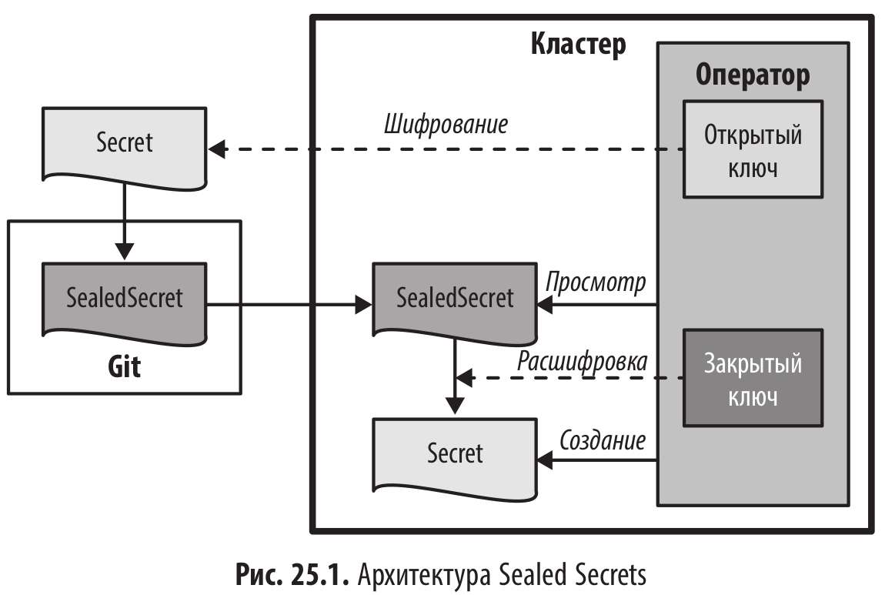
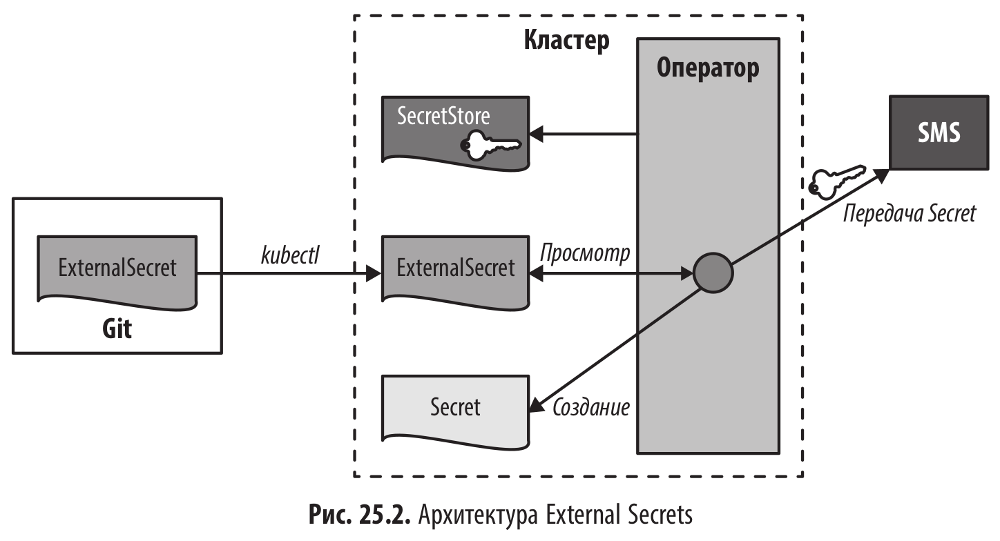
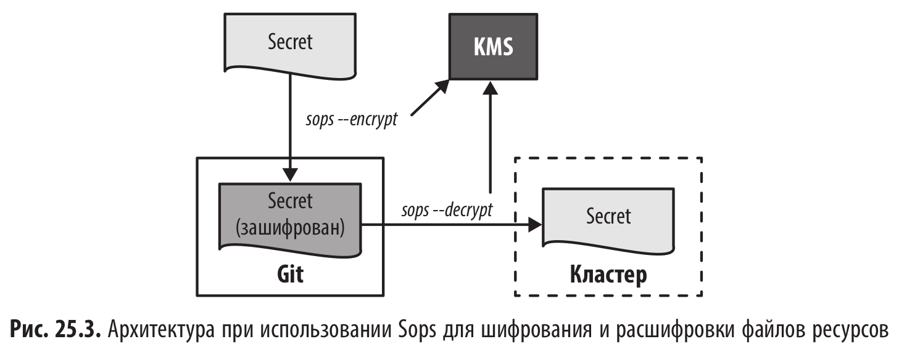
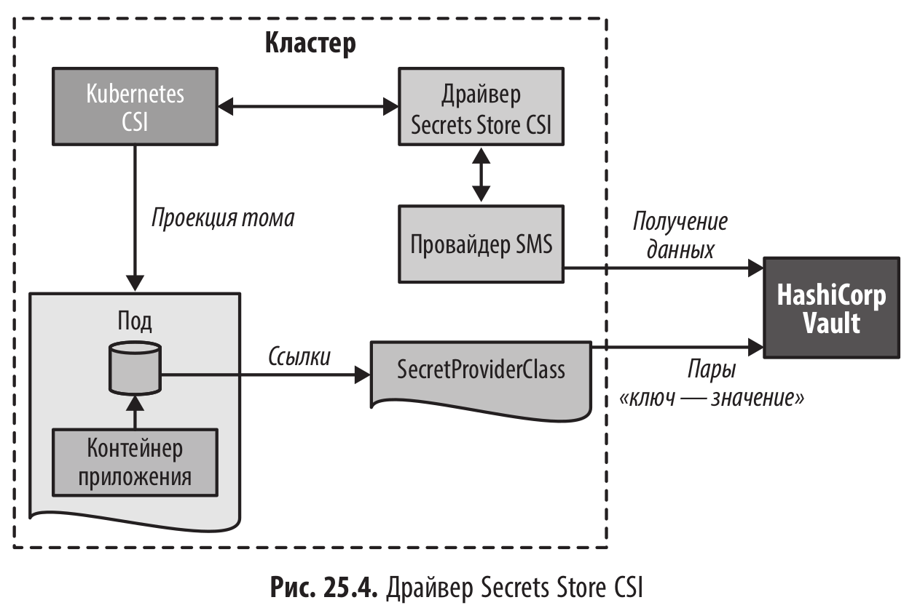
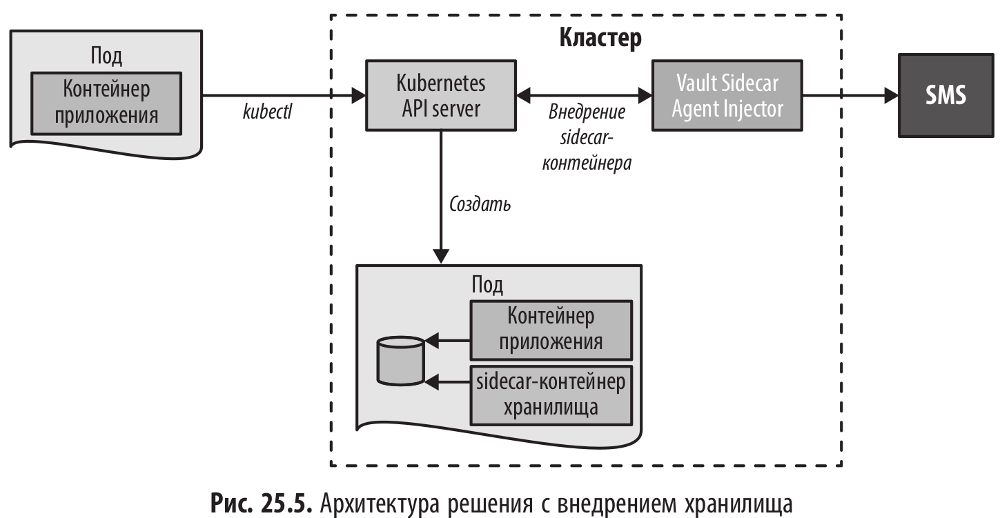

# Безопасная конфигурация (SecureConfiguration) - способы обеспечения максимальной безопасности учетных данных

Способы обеспечения безопасности данных конфигурации в Kubernetes можно условно разделить на две категории:

- Шифрование вне кластера (Sealed Secrets, External Secrets и Sops) - Зашифрованная информация о конфигурации хранится вне Kubernetes, где к ней имеют доступ и неавторизованные пользователи, а преобразование в Secret происходит непосредственно перед входом в кластер (например, при применении ресурса через API Server) или внутри кластера постоянно работающим процессом-оператором.

- Централизованное управление секретами - Для хранения конфиденциальных данных конфигурации используются специализированные сервисы, которые либо предлагаются поставщиками облачных услуг (например, AWS Secrets Manager или Azure Key Vault), либо являются частью внутреннего сервиса хранилища (например, HashiCorp Vault).

<br/>

## Шифрование вне кластера

<br/>

### Sealed Secret

Оператор Sealed Secrets (https://github.com/bitnami-labs/sealed-secrets)

<br/>



<br/>

Иидея в том, чтобы хранить зашифрованные данные в нестандартном ресурсе (CRD) SealedSecret. Оператор отслеживает в фоновом режиме такие ресурсы и создает свой Secret с расшифрованным содержанием для каждого SealedSecret. Если расшифровка происходит внутри кластера, то шифрование — снаружи с помощью инструмента командной строки kubeseal, транслирующего Secret в SealedSecret, который можно безопасно хранить в системе управления исходным кодом, такой как Git.

Secret шифруется с помощью AES-256-GCM с формированием сессионного ключа, который шифруется асимметрично с помощью RSA-OAEP.

Закрытый ключ хранится в кластере и автоматически создается оператором SealedSecret. Администратор должен позаботиться о создании резервной копии этого ключа, а при необходимости — о его ротации. Открытый ключ, используемый kubeseal, можно получить напрямую из кластера или из файла. Открытый ключ также можно безопасно хранить в Git вместе с SealedSecret.

При создании SealedSecret из Secret можно выбрать одну из следующих областей действия:

- Строгая - Режим по умолчанию, в котором можно использовать SealedSecret только в том же пространстве имен и с тем же именем, что и исходный Secret.
- Пространство имен - Позволяет изменить имя SealedSecret на отличное от Secret, но в том же пространстве имен.
- Кластер - Допустимо изменение имени SealedSecret и применение в разных пространствах имен.

<br/>

```yaml
# Команда для создания SealedSecret :
# kubeseal --scope cluster-wide -f mysecret.yaml
apiVersion: bitnami.com/v1alpha1
kind: SealedSecret
metadata:
  annotations:
    sealedsecrets.bitnami.com/cluster-wide: 'true'
  name: DB-credentials
spec:
  encryptedData:
    password: AgCrKIIF2gA7tSR/gqw+FH6cEV..wPWWkHJbo=
    user: AgAmvgFQBBNPlt9Gmx..0DNHJpDIMUggwaQroXT+o=
```

<br/>

Sealed Secret — инструмент, позволяющий хранить зашифрованные значения Secret в общедоступном месте, например в репозитории GitHub. Важно правильно управлять резервным копированием секретного ключа, так как без него невозможно расшифровать данные, если оператор будет удален. Одним из недостатков Sealed Secrets является то, что для выполнения расшифровки требуется, чтобы оператор на стороне сервера был постоянно запущен в кластере.

<br/>

### External Secrets

Оператор External Secrets (https://external-secrets.io/latest/)

External Secrets Operator — это оператор Kubernetes, который использует интеграцию с внешним SMS. Главное отличие External Secrets от Sealed Secrets заключается в том, что вы полагаетесь на внешний SMS, который выполняет всю работу, включая шифрование, расшифровку и безопасное хранение. При этом можно использовать все функции SMS вашего облака, такие как ротация ключей и специальный пользовательский интерфейс. SMS также обеспечивает возможность разделения ответственности в зависимости от роли, чтобы одни пользователи управляли развертыванием приложений, а другие — секретами.

<br/>



Оператор согласует два настраиваемых ресурса:

- SecretStore хранит тип и конфигурацию внешнего SMS для доступа.
- ExternalSecret ссылается на SecretStore, и оператор создает соответствующий Kubernetes Secret с данными, извлеченными из внешнего SMS.

<br/>

```yaml
apiVersion: external-secrets.io/v1beta1
kind: SecretStore
metadata:
  name: secret-store-aws
spec:
  provider:
    aws:
      service: SecretsManager
      region: us-east-1
      auth:
        secretRef:
          accessKeyIDSecretRef:
            name: awssm-secret
            key: access-key
          secretAccessKeySecretRef:
            name: awssm-secret
            key: secret-access-key
```

<br/>

```yaml
apiVersion: external-secrets.io/v1beta1
kind: ExternalSecret
metadata:
  name: db-credentials
spec:
  refreshInterval: 1h
  secretStoreRef:
    name: secret-store-aws
    kind: SecretStore
  target:
    name: db-credentials-secrets
    creationPolicy: Owner
  data:
    - key: cluster/db-username
      remoteRef:
        key: cluster/db-username
      name: username
    - key: cluster/db-password
      remoteRef:
        key: cluster/db-password
      name: password
```

<br/>

Одним из существенных преимуществ External Secrets по сравнению с решением на стороне клиента является то, что только оператор на стороне сервера знает аутентификационные данные во внешней системе SMS.

<br/>

### Secret OPerationS (Sops)

Sops (https://github.com/getsops/sops)

Работает полностью за пределами кластера Kubernetes. Позволяет шифровать и расшифровывать любые файлы YAML или JSON для безопасного хранения их в репозитории исходного кода. При этом шифруются все значения такого документа, но не ключи.

<br/>

**Sops позволяет использовать различные методы шифрования:**

- Асимметричное локальное шифрование с помощью age (https://github.com/Filo-
  Sottile/age) с ключами, хранящимися локально.
- Хранение секретного ключа шифрования в централизованной системе управ ления ключами (Key Management System, KMS). Поддерживаемые платформы: облачные AWS KMS, Google KMS и Azure Key Vault, а также HashiCorp Vault, которую можно разместить локально. Управление идентификацией на этих платформах обеспечивает тщательный контроль доступа к ключу шифрования.

Sops — это CLI-инструмент, который можно запустить на локальной машине или в кластере (например, как часть конвейера CI). Во втором варианте, особенно если вы работаете в одном из больших облаков, использование KMS облачного сервиса обеспечивает плавную интеграцию.

<br/>



<br/>

**Применение sops для получения зашифрованных секретов**

```
$ age-keygen -o keys.txt
Public key: age1j49ugcg2rzyye07ksyvj5688m6hmv

$ cat configmap.yaml
apiVersion: v1
kind: ConfigMap
metadata:
  name_unencrypted: db-auth
data:
  # Имя пользователя и пароль
  USER: "batman"
  PASSWORD: "r0b1n"

$ sops --encrypt \
  --age age1j49ugcg2rzyye07ksyvj5688m6hmv \
  configmap.yaml > configmap_encrypted.yaml

$ cat configmap_encrypted.yaml
apiVersion: ENC[AES256_GCM,data:...,iv:...,tag:...,type:str]
kind: ENC[AES256_GCM,data:...,iv:...,tag:...,type:str]
metadata:
  name_unencrypted: db-auth
data:
  #ENC[AES256_GCM,data:...,iv:...,tag:...,type:comment]
  USER: ENC[AES256_GCM,data:...,iv:...,tag:...,type:str]
  PASSWORD: ENC[AES256_GCM,data:...,iv:...,tag:...,type:str]
sops:
  age:
    - recipient: age1j49ugcg2rzyye07ksyvj5688m6hmv
      enc: |
        -----BEGIN AGE ENCRYPTED FILE-----
        YWdlLWV1Y3J5cHRpbm9u3JnL3YxCi0+IFgyNTUxOSBqems3QkU4aXRyQWxaNER1
        TTdqcUZTEXFNWhSY0E1T05XMUhvVUzFjR1FnCMdMZmhlSlZCRHlqTzlNM0E1Z280
        Y0tqQ2VKYXdxdDZIZHpDbmxTYzhQSTgKLS0tIHNlbYmloL2laZlA4Q05DTmRwQ0ls
        bURoU2xITHNzSXp5US9mUUV0Z0RackkkFTH+uNNe3A13pzSvHjT6n3q9av0pN7Nb
        i3AULtKvAGs6oAnH8qYbnwoj3qt/LFfnbqfeFk1zC2uQNONWkKxa2Q==
        -----END AGE ENCRYPTED FILE-----
  lastmodified: "2022-09-20T09:56:49Z"
  mac: ENC[AES256_GCM,data:...,iv:...,tag:...,type:str]
  unencrypted_suffix: _unencrypted
```

<br/>

Как видим, шифруется каждое значение ресурса ConfigMap, включая те, что не являются конфиденциальными, например типы ресурсов и имя ресурса. Можно предотвратить шифрование определенных значений, добавив к имени ключа суффикс \_unencrypted, который при расшифровке будет удален.

Сгенерированный файл configmap_encrypted.yml можно безопасно хранить в Git или любой другой системе управления исходным кодом.

<br/>

**Расшифровка ресурса и применение его к Kubernetes**

```shell
$ export SOPS_AGE_KEY_FILE=keys.txt
$ sops --decrypt configmap_encrypted.yaml | kubectl apply -f -
```

<br/>

Sops хорошо подходит при использовании концепции GitOps и позволяет не беспокоиться об установке и обслуживании дополнений Kubernetes. Однако хотя конфигурация может безопасно храниться в Git, важно понимать, что как только эти данные будут переданы в кластер, любой пользователь с расширенными правами доступа сможет прочитать их напрямую через API Kubernetes.

Если это недопустимо, придется обратиться к централизованным SMS.

<br/>

## Централизованное управление секретами

### Драйвер Secrets Store CSI

Secrets Store CSI (https://github.com/kubernetes-sigs/secrets-store-csi-driver). Разработан и поддерживается сообществом Kubernetes.

Он обеспечивает доступ к централизованным SMS и монтирует их как обычные тома Kubernetes. Его отличие от монтированного тома Secret, заключается в том, что информация в этом случае хранится не в базе данных Kubernetes etcd, а безопасно за пределами кластера.

Драйвер Secrets Store CSI поддерживает SMS от основных поставщиков облачных услуг (AWS, Azure и GCP), а также HashiCorp Vault.

<br/>

Настройка Kubernetes для подключения менеджера секретов через драйвер CSI включает выполнение двух административных задач:

- Установка драйвера Secrets Store CSI и настройка доступа к определенному
  SMS. Для установки требуются разрешения администратора кластера.
- Настройка правил и политик доступа — несколько шагов, специфичных для поставщика. В результате учетная запись сервиса Kubernetes сопоставляется с ролью менеджера секретов, которая разрешает доступ к секретам.

<br/>



После завершения настройки использование томов с секретами не представляет сложностей. Сначала необходимо определить SecretProviderClass, как показано в листинге 25.6. В этом ресурсе вы выбираете внутреннего поставщика для менеджера секретов — в нашем примере мы выбрали хранилище HashiCorp. В разделе parameters добавляется индивидуальная конфигурация для поставщика. Она содержит параметры подключения к хранилищу и роли, а также указатель на информацию, которую Kubernetes будет монтировать в под.

<br/>

```yaml
apiVersion: secrets-store.csi.x-k8s.io/v1
kind: SecretProviderClass
metadata:
  name: vault-database
spec:
  provider: vault
  parameters:
    vaultAddress: 'http://vault.default:8200'
    roleName: 'database'
    objects: |
      - objectName: "database-password"
        secretPath: "secret/data/database-creds"
        secretKey: "password"
```

<br/>

Обратите внимание, что учетная запись сервиса vault-access-sa, с которой работает под, должна быть настроена на стороне Vault и включена в определение роли database, на которую ссылается SecretProviderClass.

<br/>

```yaml
kind: Pod
apiVersion: v1
metadata:
  name: shell-pod
spec:
  serviceAccountName: vault-access-sa
  containers:
    - image: k8spatterns/random
      volumeMounts:
        - name: secrets-store
          mountPath: '/mnt/secrets-store'
  volumes:
    - name: secrets-store
      csi:
        driver: secrets-store.csi.k8s.io
        readOnly: true
        volumeAttributes:
          secretProviderClass: 'vault-database'
```

<br/>

Сложность настройки CSI Secret Storage компенсируется простотой использования и результатом — конфиденциальные данные можно хранить вне Kubernetes.
Однако он содержит больше подвижных частей, чем обычный Secret, поэтому при его использовании выше риски ошибок и их сложнее устранять.

<br/>

### Внедрение пода

<br/>

HashiCorp Vault Sidecar Agent Injector (https://developer.hashicorp.com/vault/docs/platform/k8s/injector-csi#vault-sidecar-agent-injector)

Этот контроллер реализован как изменяющийся вебхук (mutating webhook), который позволяет модифицировать любой ресурс при его создании. Когда спецификация пода содержит определенную аннотацию, специфичную для хранилища, контроллер хранилища может изменить эту спецификацию, добавив контейнер для синхронизации с хранилищем и смонтировав том для секретных данных.

<br/>



<br/><br/>

---

<br/>

<a href="https://k8s.ru/">Предложить инженеру работу / подработку на проекте с kubernetes, microservices, machine learning, big data, golang</a>
