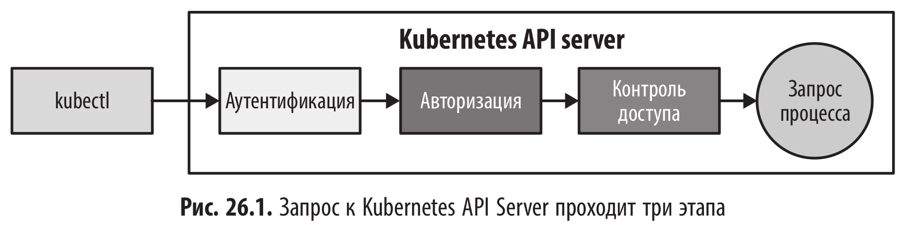
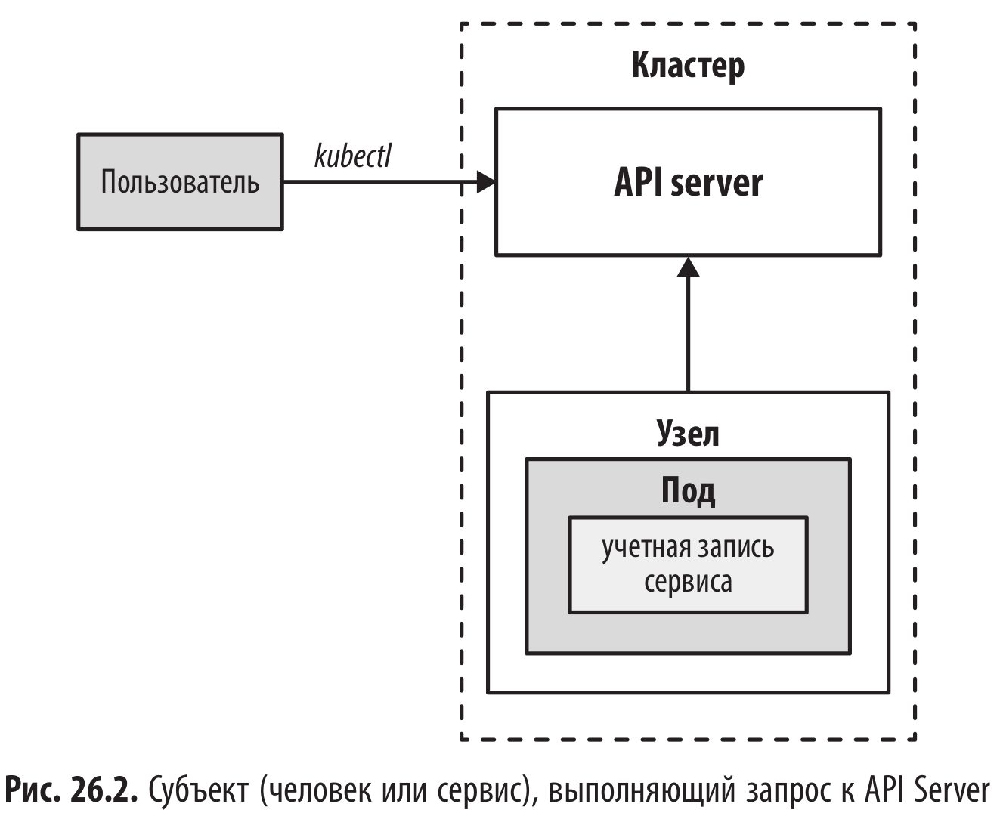
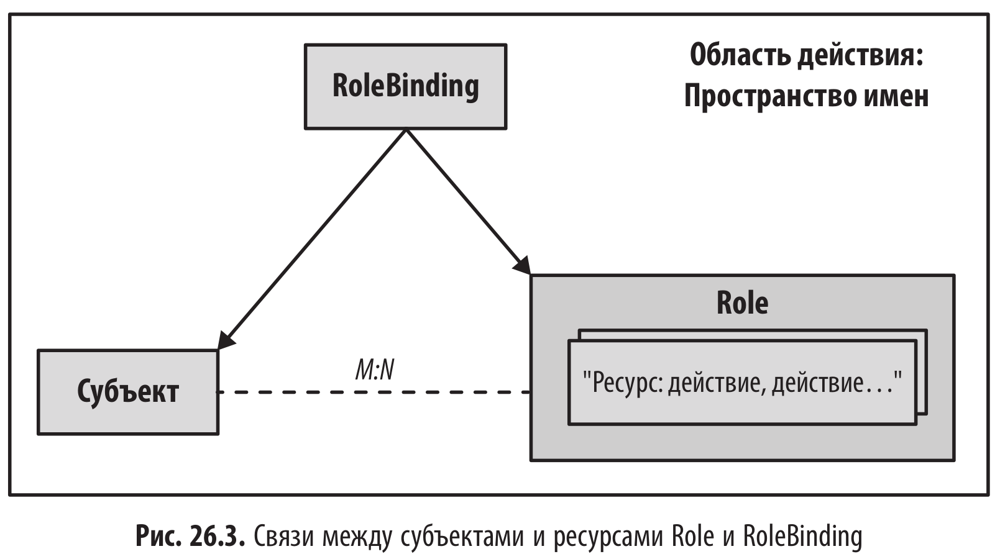
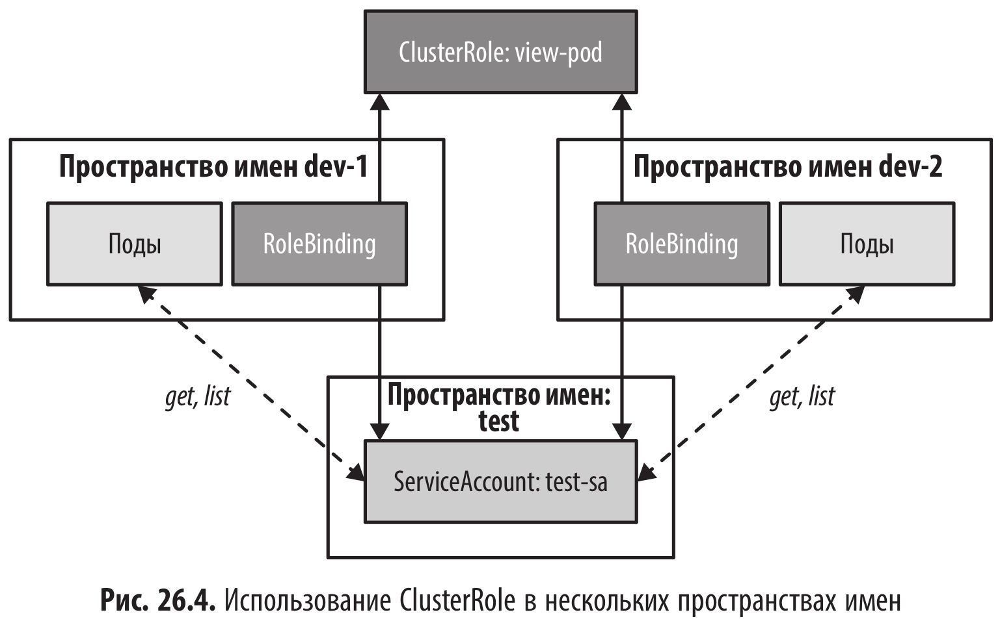
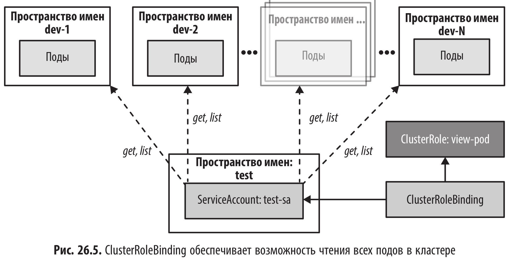

# Контроль доступа (AccessControl) - аутентификация и взаимодействие с Kubernetes API

<br/>

<br/>



<br/>

**Аутентификация**

- Bearer-токены OpenID Connect - Bearer-токены OpenID Connect (OIDC) могут использоваться для аутентификации клиентов и предоставления доступа к API Server. OIDC — это стандартный протокол, который позволяет клиентам проходить аутентификацию с помощью поставщика OAuth2, поддерживающего OIDC. Клиент отправляет токен OIDC в заголовке Authorization своего запроса, а API Server проверяет токен, чтобы разрешить доступ.

- Сертификаты X.509 - Клиент передает API Server сертификат TLS, который проверяется и используется для предоставления доступа.

- Прокси-сервер аутентификации - Можно настроить прокси-сервер аутентификации для проверки личности клиента перед предоставлением доступа к API Server. Тогда прокси-сервер выступает в качестве посредника между клиентом и сервером API, выполняя проверки аутентификации и авторизации.

- Файлы статических токенов - Токены аутентификации могут записываться в обычные файлы. В этом случае токен, сохраненный на API Server, сравнивается с токенами в файлах.

- Аутентификация токенов через вебхуки - При использовании вебхуков для аутентификации и предоставления доступа к API Server клиент отправляет токен в заголовке Authorization своего запроса, а API Server пересылает токен настроенному вебхуку для проверки. Если вебхук возвращает допустимый ответ, клиенту предоставляется доступ к API Server.
  Этот метод похож на вариант с Bearer-токенами OIDC, за исключением того, что для проверки токена можно использовать внешний сервис.

<br/>

**Авторизация**

Для управления доступом в Kubernetes по умолчанию используется модель на основе ролей — RBAC (role based access control).

<br/>

**Контроллеры доступа**

Контроллеры доступа — это функция API Kubernetes, которая позволяет перехватывать запросы к API Server и выполнять действия на основе этих запросов.

<br/>

## Субъект

Субъект — это тот, кто выполняет запрос к Kubernetes API Server. В Kubernetes есть два типа субъектов - пользователи (люди) и учетные
записи сервисов, идентифицирующие рабочую нагрузку подов.

<br/>



<br/>

Пользователи-люди и учетные записи сервисов (ресурс ServiceAccount) могут образовывать группы пользователей и группы учетных записей сервиса соответственно. Такая группа представляет собой единый субъект, все члены которого пользуются одним и тем же набором разрешений.

<br/>

### Users (Пользователи)

В отличие от многих других сущностей, пользователи-люди не определены как явные ресурсы API Kubernetes. Это решение подразумевает, что управлять пользователями через вызов API нельзя. Аутентификация и сопоставление с субъектом происходит вне обычного механизма API Kubernetes с помощью внешнего
управления.

Kubernetes поддерживает множество способов аутентификации внешнего пользователя. Каждый компонент знает, как извлечь информацию о субъекте после успешной аутентификации. Хотя эти компоненты используют разные механизмы, в итоге они получают одно и то же представление пользователя и добавляют его в запрос API для дальнейшей проверки.

<br/>

```
alice,4bc01e30-406b-4514,"system:authenticated,developers","scopes:openid"
```

Эти элементы, разделенные запятыми, образуют представление пользователя, содержащее следующие части:

- Имя пользователя — alice.
- Уникальный идентификатор пользователя (UID) — 4bc01e30-406b-4514.
- Список групп, к которым принадлежит пользователь (через запятую), — system:authenticated, developers.
- Дополнительная информация в формате пар «ключ — значение», разделенных запятыми, — scopes:openid.

Эта информация обрабатывается плагином Authorization по правилам, установленным для пользователя или его группы.

В примере, пользователь с именем alice имеет доступ по умолчанию, определенный для групп system:authenticated и developers. Дополнительная информация scope:openid указывает, что для аутентификации используется протокол OIDC.

<br/>

### ServiceAccount (Учетные записи сервисов)

Учетные записи сервисов в Kubernetes представляют собой субъекты, не являющиеся людьми, и используются в качестве идентификаторов рабочей нагрузки. Они связаны с подами и позволяют процессам, запущенным в поде, взаимодействовать с Kubernetes API Server. Если для аутентификации пользователей-людей существуют разные способы, то для сервисов применяется только OIDC (https://openid.net/specs/openid-connect-core-1_0.html#Overview) и токены доступа JSON Web Tokens для подтверждения идентичности.

Сервисы в Kubernetes аутентифицируются сервером API по имени пользователя в следующем формате: system:serviceaccount:<namespace>:<name>. Например, если имеется учетная запись сервиса random-sa в пространстве имен default, то будет использоваться имя system:serviceaccount:default:random-sa.

<br/>

```yaml
apiVersion: v1
kind: ServiceAccount
metadata:
  name: random-sa
  namespace: default
automountServiceAccountToken: false
***
```

<br/>

automountServiceAccountToken: false - Флаг, указывающий, должен ли токен учетной записи сервиса быть монтирован по умолчанию в поде. Значение флага по умолчанию — true.

ServiceAccount имеет простую структуру и позволяет определять все параметры авторизации, необходимые поду при обмене данными с Kubernetes API Server. Каждое пространство имен имеет ServiceAccount по умолчанию с именем default, используемый для идентификации подов, для которых не определены собственные ServiceAccount.

Каждый ServiceAccount имеет связанный с ним JWT, который управляется ­бэкендом Kubernetes. Связанный токен ServiceAccount автоматически монтируется в файловую систему пода.

<br/>

```yaml
apiVersion: v1
kind: Pod
metadata:
  name: random
spec:
  serviceAccountName: default
  containers:
    - name: my-container
      image: nginx # Добавил пример образа, так как в листинге он пропущен
      volumeMounts:
        - mountPath: /var/run/secrets/kubernetes.io/serviceaccount
          name: kube-api-access-vzfp7
          readOnly: true
  volumes:
    - name: kube-api-access-vzfp7
      projected:
        defaultMode: 420
        sources:
          - serviceAccountToken:
              expirationSeconds: 3600
              path: token
```

Чтобы просмотреть монтированный токен, можно выполнить команду cat для монтированного файла в работающем поде.

<br/>

```shell
$ kubectl exec random -- \
cat /var/run/secrets/kubernetes.io/serviceaccount/token
```

<br/>

Ресурс ServiceAccount имеет дополнительные поля, хранящие учетные данные для скачивания образов контейнеров, а также для определения, какие секреты разрешено монтировать:

**Секреты для скачивания образов**

Такие секреты позволяют рабочей нагрузке при скачивании образов проходить аутентификацию в непубличном реестре. При традиционном подходе требуется вручную указать секреты извлечения образов в полях .spec.imagePullSecrets спецификации пода. Однако Kubernetes также предоставляет ярлык, позволяющий прикрепить секрет для скачивания непосредственно к ServiceAccount в поле верхнего уровня imagePullSecrets. Тогда при создании пода, связанного с ServiceAccount, в его спецификацию автоматически будут добавляться секреты скачивания. При этом устраняется необходимость вручную включать секреты скачивания образа в спецификацию каждый раз, когда в пространстве имен создается новый под.

**Монтируемые секреты**

В поле secrets в ресурсе ServiceAccount можно указать, какие секреты позволяет монтировать под, связанный с ServiceAccount. Чтобы включить это ограничение, нужно добавить к ServiceAccount аннотацию kubernetes.io/enforce-mountable-secrets. Если эта аннотация установлена в значение true, то только перечисленные секреты будут разрешены для монтирования в поде, связанном с ServiceAccount.

<br/>

### Groups (Группы)

Учетные записи как пользователей, так и сервисов в Kubernetes могут принадлежать к одной или нескольким группам. Группы прикрепляются к запросам и служат для предоставления набора разрешений всем членам группы.

<br/>

## Управление доступом на основе ролей

В Kubernetes роли (Role) определяют действия, которые субъект может выполнять с определенными ресурсами. Роли можно назначать субъектам, таким как пользователи или учетные записи сервисов, с помощью ресурса RoleBinding. Role и RoleBinding создаются и управляются как любые другие ресурсы Kubernetes. Они привязываются к определенному пространству имен и применяются к его ресурсам.

<br/>



<br/>

Важно понимать, что в механизме управления доступом на основе ролей (RBAC) в Kubernetes между субъектами и ролями существует отношение «многие ко многим». Это означает, что один субъект может иметь несколько ролей, а одна роль может быть назначена нескольким субъектам. Связь между субъектом и ролью устанавливается с помощью ресурса RoleBinding, который содержит ссылки на список субъектов и определенную роль.

<br/>

```yaml
apiVersion: rbac.authorization.k8s.io/v1
kind: Role
metadata:
  name: developer-ro
  namespace: default
rules:
  - apiGroups:
      - ''
    resources:
      - pods
      - services
    verbs:
      - get
      - list
      - watch
```

Затем на эту роль можно сослаться в RoleBinding,чтобы предоставить доступ пользователю alice и учетной записи сервиса con­tractor.

```yaml
apiVersion: rbac.authorization.k8s.io/v1
kind: RoleBinding
metadata:
  name: dev-rolebinding
subjects:
  - kind: User
    name: alice
    apiGroup: rbac.authorization.k8s.io
  - kind: ServiceAccount
    name: contractor
    apiGroup: ''
roleRef:
  kind: Role
  name: developer-ro
  apiGroup: rbac.authorization.k8s.io
```

<br/>

### Role

Роли позволяют определять набор разрешенных действий для группы ресурсов или подресурсов Kubernetes. Типичные действия с ресурсами Kubernetes:

- получение подов;
- удаление секретов;
- обновление ConfigMap;
- создание ServiceAccount.

Чтобы роль получила доступ, достаточно хотя бы одного правила, соответствующего запросу. Каждое правило описывается тремя параметрами.

- apiGroups - список групп API-правила. Использование подстановочных знаков позволяет указывать ресурсы нескольких групп API. Например, пустая строка (“”) используется для группы API, которая содержит основные ресурсы Kubernetes, такие как поды и сервисы. Подстановочный знак (\*) соответствует всем доступным группам API кластера.

- resources - ресурсы, к которым Kubernetes должен предоставить доступ. Каждая запись должна соответствовать как минимум одной из настроенных apiGroups. Запись с подстановочным знаком \* означает, что разрешены все ресурсы всех указанных выше apiGroups.

- verbs - глаголы определяют разрешенные действия в системе. Они похожи на методы HTTP и включают операции CRUD с ресурсами (CRUD означает Create-Read-Update-Delete и описывает обычные операции чтения-записи, которые можно выполнять с постоянными сущностями), а также отдельные действия над коллекциями, такие как list и deletecollection. Кроме того, глагол watch позволяет получать доступ к событиям изменения ресурсов, что отличает его от прямого чтения с помощью get и обеспечивает уведомление операторов о текущем состоянии ресурсов, которыми они управляют. Также можно использовать подстановочный символ \*, чтобы разрешить правилу все операции над всеми указанными выше ресурсами.

<br/>

Сопоставление глаголов Kubernetes с методами HTTP для операций CRUD

| Глагол                    | Метод HTTP |
| ------------------------- | ---------- |
| get, watch, list          | GET        |
| create                    | POST       |
| patch                     | PATCH      |
| update                    | PUT        |
| delete, delete collection | DELETE     |

<br/>

### RoleBinding

Каждый RoleBinding может связывать список субъектов с одной ролью. Список subjects предназначен для ссылок на ресурсы, каждая из которых имеет параметры name (имя), kind (тип) и apiGroup (группа API).
Субъект в RoleBinding может принадлежать к одному из следующих типов:

- User (Пользователь) - Человек или система, аутентифицированные сервером API. Параметр apiGroup для пользователей имеет фиксированное значение rbac.authorization.k8s.io.

- Group (Группа) - Группа представляет собой набор пользователей, как описано в разделе «Группы». Как и для пользователей, параметр apiGroup имеет значение rbac.authorization.k8s.io.

- ServiceAccount (Учетная запись сервиса) Такие субъекты относятся к основной группе API, для указания которой служит пустая строка (""). Это единственный тип субъекта, для которого может настраиваться пространство имен. Такая настройка позволяет предоставлять доступ подам из других пространств имен.

<br/>

**Параметры субъектов в списке subject ресурса RoleBinding**

| Тип (Kind)     | Группа API (apiGroup)     | Пространство имен (namespace) | Описание                                                      |
| -------------- | ------------------------- | ----------------------------- | ------------------------------------------------------------- |
| User           | rbac.authorization.k8s.io | —                             | name — ссылка на пользователя                                 |
| Group          | rbac.authorization.k8s.io | —                             | name — ссылка на группу пользователей                         |
| ServiceAccount | ""                        | Опционально                   | name — ссылка на ServiceAccount в указанном пространстве имен |

<br/>

Также RoleBinding указывает на одну роль, которая может быть определена либо ресурсом Role в том же пространстве имен, что и RoleBinding, либо ресурсом ClusterRole, общим для нескольких RoleBinding в кластере.

Подобно субъектам, ссылка на Role имеет параметры name, kind и apiGroup.

<br/>

**Параметры в списке roleRef ресурса RoleBinding**

| Тип (Kind)  | Группа API (apiGroup)     | Описание                                         |
| ----------- | ------------------------- | ------------------------------------------------ |
| Role        | rbac.authorization.k8s.io | name — ссылка на Role в том же пространстве имен |
| ClusterRole | rbac.authorization.k8s.io | name — ссылка на ресурс кластера ClusterRole     |

<br/>

### ClusterRole

ClusterRole в Kubernetes похож на обычный ресурс Role, но применяется ко всему кластеру, а не к определенному пространству имен. Обычно он используется в двух сценариях:

- Защита ресурсов кластера, таких как CustomResourceDefinitions или Storage-Classes. Эти ресурсы обычно управляются на уровне администратора кластера и требуют специального контроля доступа. Например, разработчики могут иметь доступ на чтение этих ресурсов, но для редактирования они должны обратиться за помощью. ClusterRoleBinding используется для предоставления доступа к ресурсам уровня кластера.

- Определение типичных ролей, которые используются в нескольких пространствах имен. Как мы видели в предыдущем разделе, RoleBinding может ссылаться только на роли, определенные в том же пространстве имен. Ресурс ClusterRole позволяет настроить общие роли, доступные во всем кластере (например, роль «view», разрешающая доступ только для чтения ко всем ресурсам кластера), что может быть использовано RoleBinding в любом пространстве имен кластера.

Пример определения ресурса ClusterRole, который может использоваться в нескольких RoleBinding. Схема аналогична Role, за исключением того, что игнорируются поля .meta.namespace.

<br/>

```yaml
apiVersion: rbac.authorization.k8s.io/v1
kind: ClusterRole
metadata:
  name: view-pod
rules:
  - apiGroups:
      - ''
    resources:
      - pods
    verbs:
      - get
      - list
```

<br/>



<br/>

Рисунок показывает, что один ресурс ClusterRole может быть общим для нескольких ресурсов RoleBinding в разных пространствах имен. В этом примере ClusterRole позволяет читать поды в пространствах имен dev-1 и dev-2 ресурсу ServiceAccount, находящемуся в пространстве имен test.

Использование одного ресурса ClusterRole для нескольких RoleBinding позволяет создавать типовые схемы контроля доступа.

<br/>

**Стандартные значения ClusterRole**

| ClusterRole   | Описание                                                                                                 |
| ------------- | -------------------------------------------------------------------------------------------------------- |
| view          | Позволяет читать большинство ресурсов в пространстве имен, за исключением Role, RoleBinding и Secret.    |
| edit          | Позволяет читать и изменять большинство ресурсов в пространстве имен, за исключением Role и RoleBinding. |
| admin         | Предоставляет полный контроль над всеми ресурсами в пространстве имен, включая Role и RoleBinding.       |
| cluster-admin | Предоставляет полный контроль над всеми ресурсами в пространстве имен, включая ресурсы кластера.         |

Полный список доступных по умолчанию ресурсов ClusterRole можно просмотреть с помощью команды kubectl get clusterroles

<br/>

```shell
$ kubectl get clusterroles
```

<br/>

Иногда требуется объединить разрешения, определенные в разных ресурсах ClusterRole. Один из способов сделать это — создать несколько экземпляров RoleBinding, которые ссылаются на эти ресурсы ClusterRole. Но есть и более элегантное решение — агрегация.

Чтобы использовать агрегацию, следует определить ресурс ClusterRole с пустым полем rules и списком селекторов меток в параметре aggregationRule. Тогда правила, определенные для каждого ClusterRole с метками, соответствующими селекторам, будут объединены и использованы для заполнения поля rules, агрегированного ClusterRole.

Метод агрегации позволяет динамически создавать большие наборы правил, объединяя специализированные ресурсы ClusterRole.

<br/>

```yaml
apiVersion: rbac.authorization.k8s.io/v1
kind: ClusterRole
metadata:
  name: view
  labels:
    rbac.authorization.k8s.io/aggregate-to-edit: 'true'
aggregationRule:
  clusterRoleSelectors:
    - matchLabels:
        rbac.authorization.k8s.io/aggregate-to-view: 'true'
rules: [] # 3
```

<br/>

Листинг показывает, как роль по умолчанию view использует агрегацию для выбора конкретных экземпляров ClusterRole с метками rbac.authorization.k8s.io/aggregate-to-view. При этом роль view имеет метку rbac.authorization.k8s.io/aggregate-to-edit, которая используется ролью edit для включения агрегированных правил из параметра view ресурса ClusterRole.

<br/>

### ClusterRoleBinding

ClusterRoleBinding похож на ресурс RoleBinding, за исключением того, что он игнорирует параметр пространства имен. Правила, определенные в ClusterRoleBinding, применяются ко всем пространствам имен в кластере.

<br/>

```yaml
apiVersion: rbac.authorization.k8s.io/v1
kind: ClusterRoleBinding
metadata:
  name: test-sa-crb
subjects:
  - kind: ServiceAccount
    name: test-sa
    namespace: test
roleRef:
  kind: ClusterRole
  name: view-pod
  apiGroup: rbac.authorization.k8s.io
```

<br/>

Правила, определенные в ClusterRole view-pod, применяются ко всем пространствам имен в кластере, так что любой под, связанный с учетной записью сервиса test-sa, может читать все поды в любом пространстве имен. Однако ClusterRoleBinding нужно использовать с осторожностью, поскольку такие ресурсы предоставляют широкие разрешения доступа ко всему кластеру.

ClusterRoleBinding удобен автоматическим предоставлением разрешений во вновь созданных пространствах имен. Однако для более детального контроля над разрешениями, как правило, лучше использовать отдельные ресурсы RoleBinding для каждого пространства имен. Эти дополнительные меры позволят снизить риск несанкционированного доступа к таким пространствам имен, как kube-system.

<br/>



ClusterRoleBindings следует использовать только для административных задач — управления общими ресурсами кластера, такими как Nodes, Namespaces и CustomResourceDefinitions.

<br/>

### Отладка правил RBAC

```shell
$ kubectl auth can-i \
list pods --namespace dev-1 --as system:serviceaccount:test:test-sa
```

<br/>

Лучше понять, какие действия может выполнять субъект на ресурсах, поможет плагин rakkess (https://github.com/corneliusweig/rakkess), который
запускается командой kubectl access-matrix. Rakkess обеспечивает матричное отображение действий, которые субъект может выполнять на определенных ресурсах.

Еще один инструмент, помогающий визуализировать и детально проверить информацию о разрешениях, — это KubiScan (https://github.com/cyberark/KubiScan). Он позволяет сканировать кластер Kubernetes на наличие разрешений с высокими рисками.

<br/><br/>

---

<br/>

<a href="https://k8s.ru/">Предложить инженеру работу / подработку на проекте с kubernetes, microservices, machine learning, big data, golang</a>
