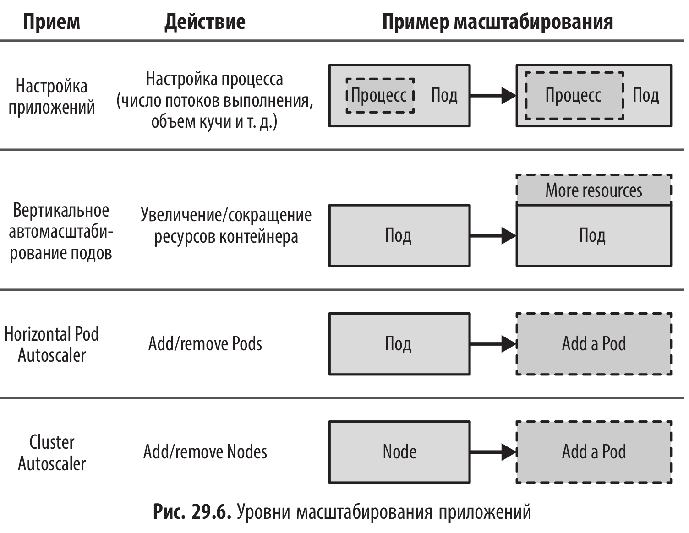

# Эластичное масштабирование (Elastic Scale) - hpa, vpa, ca

<br/>



<br/>

Под горизонтальным масштабированием в мире Kubernetes подразумевается создание большего количества реплик пода. Под вертикальным масштабированием подразумевается увеличение объема ресурсов для контейнеров, управляемых подами.

Kubernetes изначально предназначен для управления неизменяемыми контейнерами с неизменяемыми определениями spec в подах. Это упрощает горизонтальное масштабирование, но создает проблемы для вертикального масштабирования из-за необходимости останавливать и повторно запускать поды, что может влиять на процесс планирования и вызвать сбои в работе. Это верно, даже когда под изменяет требования в меньшую сторону и хочет освободить уже выделенные ресурсы.

Еще одна проблема связана с сосуществованием VPA и HPA. В настоящее время эти два механизма действуют независимо друг от друга, что может приводить к нежелательным эффектам. Например, если HPA использует в качестве метрик процессорное время и объем памяти и VPA влияет на эти же параметры, воз­можно одновременное горизонтальное и вертикальное (двойное) масштабирование подов.

Kubernetes Cluster Autoscaler (CA) - добавление новых узлов в кластер и уда-
ление узлов из кластера в облаках.

<br/>

## Разбор примеров из книги

<br/>

## Horizontal Pod Autoscaler

<br/>

```shell
$ minikube start --memory 4096

# Enable metrics-server and heapster for measuring
$ minikube addons enable metrics-server
$ minikube addons enable heapster
```

<br/>

```yaml
$ cat << 'EOF' | kubectl apply -f -
# DeploymentConfig for starting up the random-generator-runtime
apiVersion: apps/v1
kind: Deployment
metadata:
  name: random-generator
spec:
  replicas: 1
  selector:
    matchLabels:
      app: random-generator
  template:
    metadata:
      labels:
        app: random-generator
    spec:
      containers:
        - image: k8spatterns/random-generator:1.0
          name: random-generator
          resources:
            requests:
              # Reserve 200 milli cores for this pod
              cpu: 200m
              memory: 200Mi
          ports:
            - containerPort: 8080
              protocol: TCP
---
# A service for exposing our random generator
apiVersion: v1
kind: Service
metadata:
  name: random-generator
spec:
  selector:
    app: random-generator
  ports:
    - port: 80
      protocol: TCP
      targetPort: 8080
  type: NodePort
EOF
```

<br/>

```shell
$ kubectl get pods
NAME                                READY   STATUS    RESTARTS   AGE
random-generator-778fbb99d9-cjxhd   1/1     Running   0          24s
```

<br/>

```shell
$ kubectl autoscale deployment random-generator --min=1 --max=10 --cpu-percent=50
```

<br/>

```yaml
$ cat << 'EOF' | kubectl apply -f -
apiVersion: autoscaling/v2
kind: HorizontalPodAutoscaler
metadata:
  name: random-generator
spec:
  scaleTargetRef:
    apiVersion: apps/v1
    kind: Deployment
    name: random-generator
  maxReplicas: 20
  metrics:
    - resource:
        name: cpu
        target:
          averageUtilization: 50
          type: Utilization
      type: Resource
  minReplicas: 1
EOF
```

<br/>

```shell
$ port=$(kubectl get svc random-generator -o jsonpath={.spec.ports[0].nodePort})
```

<br/>

```shell
$ while true; do curl -s http://$(minikube ip):port?burn=10000 >/dev/null; done
```

<br/>

```shell
$ watch kubectl get pods,deploy,hpa
```

<br/>

```shell
$ kubectl delete hpa random-generator
```

<br/>

## Vertical Pod Autoscaler

<br/>

```shell
$ cd ~/tmp
$ git clone git@github.com:kubernetes/autoscaler.git
$ cd ./autoscaler/vertical-pod-autoscaler
$ ./hack/vpa-up.sh
```

<br/>

```yaml
$ cat << 'EOF' | kubectl apply -f -
# DeploymentConfig for starting up the random-generator-runtime
apiVersion: apps/v1
kind: Deployment
metadata:
  name: random-generator
spec:
  replicas: 1
  selector:
    matchLabels:
      app: random-generator
  template:
    metadata:
      labels:
        app: random-generator
    spec:
      containers:
        - image: k8spatterns/random-generator:1.0
          name: random-generator
          resources:
            requests:
              # Reserve 200 milli cores for this pod
              cpu: 200m
              memory: 200Mi
          ports:
            - containerPort: 8080
              protocol: TCP
---
# A service for exposing our random generator
apiVersion: v1
kind: Service
metadata:
  name: random-generator
spec:
  selector:
    app: random-generator
  ports:
    - port: 80
      protocol: TCP
      targetPort: 8080
  type: NodePort
EOF
```

<br/>

```yaml
$ cat << 'EOF' | kubectl apply -f -
apiVersion: autoscaling.k8s.io/v1
kind: VerticalPodAutoscaler
metadata:
  name: random-generator
spec:
  updatePolicy:
    updateMode: 'Off'
  targetRef:
    apiVersion: apps/v1
    kind: Deployment
    name: random-generator
EOF
```

<br/>

```shell
$ kubectl describe vpa random-generator
Name:         random-generator
Namespace:    default
Labels:       <none>
Annotations:  <none>
API Version:  autoscaling.k8s.io/v1
Kind:         VerticalPodAutoscaler
Metadata:
  Creation Timestamp:  2026-04-25T15:06:41Z
  Generation:          1
  Resource Version:    1100
  UID:                 d42c7832-d63e-4589-a32f-d55b47a4e911
Spec:
  Target Ref:
    API Version:  apps/v1
    Kind:         Deployment
    Name:         random-generator
  Update Policy:
    Update Mode:  Off
Events:           <none>
```

<br/>

```shell
$ minikube stop && minikube delete
```

<br/><br/>

---

<br/>

<a href="https://k8s.ru/">Предложить инженеру работу / подработку на проекте с kubernetes, microservices, machine learning, big data, golang</a>
