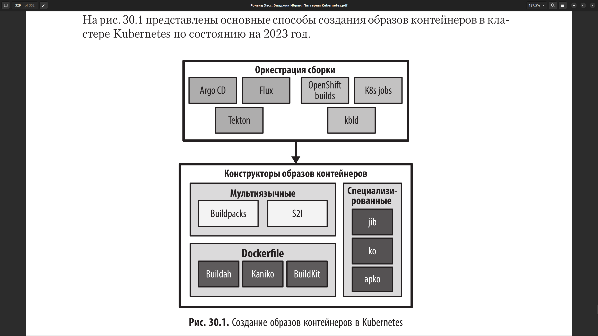
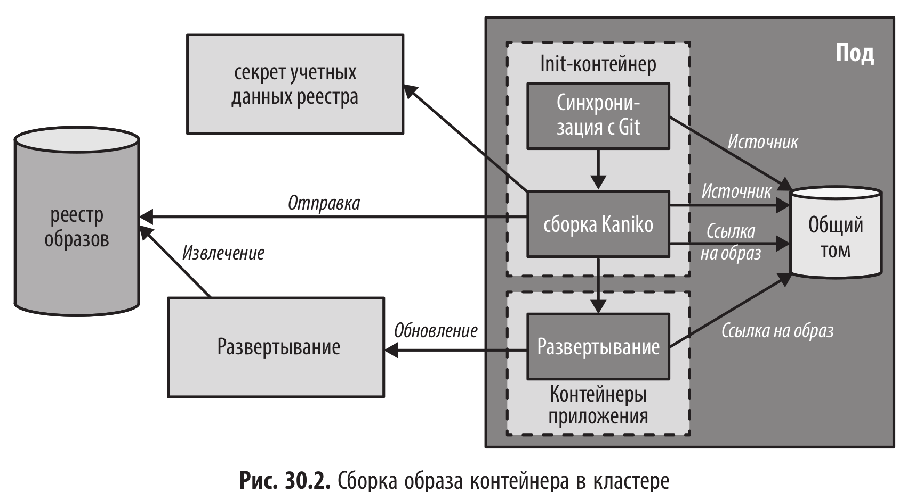

# Конструктор образов (ImageBuilder) - сборка образов контейнеров внутри kubernetes

<br/>



<br/>

Сборка в поде

<br/>



<br/>

## Разбор примеров из книги

<br/>

Раньше Knative Build был отдельным компонентом Knative, но сейчас он выделен в самостоятельный проект Tekton Pipelines.

Буду использовать kaniko.

<br/>

```shell
$ mkdir -p ~/tmp/build
$ cd ~/tmp/build
$ minikube start --mount-string="$(pwd):/build"
$ minikube addons enable registry
```

<br/>

```shell
$ cp Dockerfile ~/tmp/build/
```

<br/>

```yaml
$ cat << 'EOF' | kubectl apply -f -
apiVersion: v1
kind: Pod
metadata:
  name: kaniko
spec:
  containers:
    - name: kaniko
      image: gcr.io/kaniko-project/executor:latest
      args:
        - '--dockerfile=Dockerfile'
        - '--context=dir:///build'
        - '--insecure'
        - '--destination=registry.kube-system.svc.cluster.local/k8spatterns/kubectl-proxy:kaniko'
      volumeMounts:
        - name: build-dir
          mountPath: /build
  restartPolicy: Never
  volumes:
    - name: build-dir
      hostPath:
        path: /build
        type: Directory
EOF
```

<br/>

```shell
$ kubectl get pods
NAME     READY   STATUS      RESTARTS   AGE
kaniko   0/1     Completed   0          31s
```

<br/>

```shell
$ kubectl port-forward svc/registry -n kube-system 5000:80
```

<br/>

```shell
$ $ curl http://localhost:5000/v2/k8spatterns/kubectl-proxy/tags/list | jq
{
  "name": "k8spatterns/kubectl-proxy",
  "tags": [
    "kaniko"
  ]
}
```

<br/>

```yaml
$ cat << 'EOF' | kubectl apply -f -
apiVersion: apps/v1
kind: Deployment
metadata:
  name: kube-proxy
spec:
  replicas: 1
  selector:
    matchLabels:
      app: kube-proxy
  template:
    metadata:
      labels:
        app: kube-proxy
    spec:
      containers:
        - name: kubeapi-proxy
          image: registry.kube-system.svc.cluster.local/k8spatterns/kubectl-proxy:kaniko
        - name: shell
          image: k8spatterns/curl-jq
          command:
            - 'sleep'
            - '7200'
EOF
```

<br/>

```shell
$ kubectl get pods
NAME                         READY   STATUS             RESTARTS   AGE
kaniko                       0/1     Completed          0          6m25s
kube-proxy-df6c785d4-vdxc4   1/2     ImagePullBackOff   0          27s
```

<br/>

```shell
$ kubectl run -i --tty --rm debug --image=busybox --restart=Never -- nslookup registry.kube-system.svc.cluster.local
Server:		10.96.0.10
Address:	10.96.0.10:53

Name:	registry.kube-system.svc.cluster.local
Address: 10.108.216.165
```

<br/>

Меняю адрес registry.kube-system.svc.cluster.local на ip.

```shell
$ kubectl patch deployment kube-proxy --type='json' -p='[
  {
    "op": "replace",
    "path": "/spec/template/spec/containers/0/image",
    "value": "10.108.216.165/k8spatterns/kubectl-proxy:kaniko"
  }
]'
```

<br/>

```shell
$ kubectl get pods
NAME                          READY   STATUS      RESTARTS   AGE
kaniko                        0/1     Completed   0          6m16s
kube-proxy-6b774bbdf6-m6z42   2/2     Running     0          36s
```

<br/>

```shell
$ minikube stop && minikube delete
```

<br/><br/>

---

<br/>

<a href="https://k8s.ru/">Предложить инженеру работу / подработку на проекте с kubernetes, microservices, machine learning, big data, golang</a>
