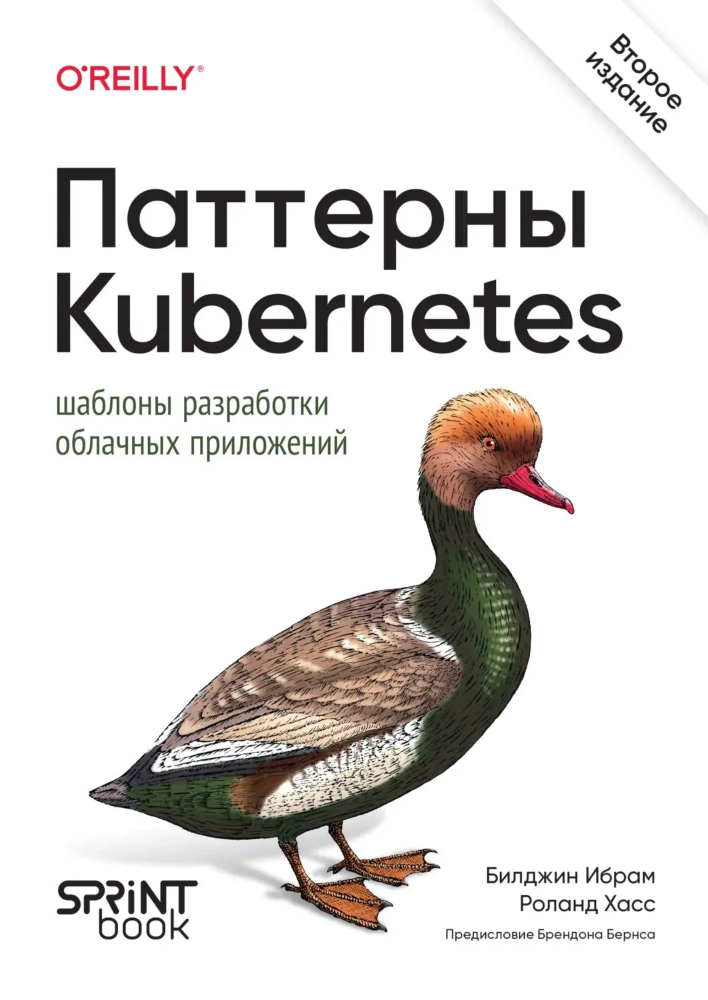

# [Книга][Ибрам Билджин, Хасс Роланд] Паттерны Kubernetes: Шаблоны разработки облачных приложений. 2-е изд. [RUS, 2026]

 

**Оригинальные исходники:**  
https://github.com/k8spatterns/examples/

 

## Оглавление:

**Часть 1: Основные паттерны (Foundational Patterns)**

<ol>
  <li>✅ Предсказуемые требования (Predictable Demands)</li>
  <li>✅ Декларативное развертывание (Declarative Deployment)</li>
  <li>✅ Проверка работоспособности (Health Probe)</li>
  <li>✅ Управляемый жизненный цикл (Managed Lifecycle)</li>
  <li>✅ Автоматическое размещение (Automated Placement)</li>
</ol>

**Часть 2: Поведенческие паттерны (Behavioral Patterns)**

<ol start="6">
  <li>✅ Пакетное задание (Batch Job)</li>
  <li>✅ Периодическое задание (Periodic Job)</li>
  <li>✅ Фоновый сервис (Daemon Service)</li>
  <li>✅ Сервис-одиночка (Singleton Service)</li>
  <li>✅ Сервис без сохранения состояния (Stateless Service)</li>
  <li>✅ Сервис с сохранением состояния (Stateful Service)</li>
  <li>✅ Обнаружение сервисов (Service Discovery)</li>
  <li>✅ Самоанализ (Self Awareness)</li>
</ol>

**Часть 3: Структурные паттерны (Structural Patterns)**

<ol start="14">
  <li>✅ Init-контейнеры (Init Container)</li>
  <li>✅ Паттерн Sidecar (Sidecar)</li>
  <li>Адаптер</li>
  <li>Посредник</li>
</ol>

**Часть 4: Паттерны конфигурации (Configuration Patterns)**

<ol start="18">
  <li>Конфигурация в переменных среды</li>
  <li>Конфигурация в ресурсах</li>
  <li>Неизменяемая конфигурация</li>
  <li>Шаблон конфигурации</li>
</ol>

**Часть 5: Паттерны безопасности (Security Patterns)**

<ol start="22">
  <li>Ограничение процессов</li>
  <li>Сегментация сети</li>
  <li>Безопасная конфигурация</li>
  <li>Контроль доступа</li>
</ol>

**Часть 6: Более сложные паттерны (Advanced Patterns)**

<ol start="26">
  <li>Контроллер</li>
  <li>Оператор</li>
  <li>Эластичное масштабирование</li>
  <li>Конструктор образов</li>
</ol>

  

---

 

<a href="https://k8s.ru/">Предложить инженеру работу / подработку на проекте с kubernetes, microservices, machine learning, big data, golang</a>
